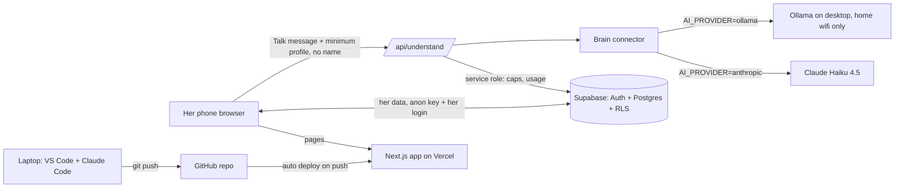
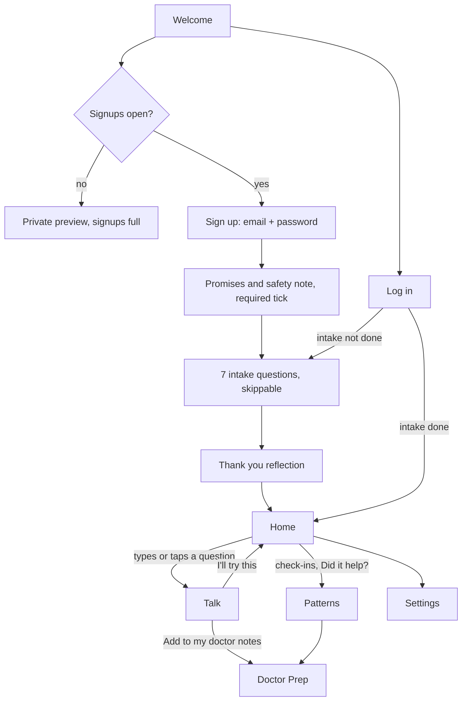
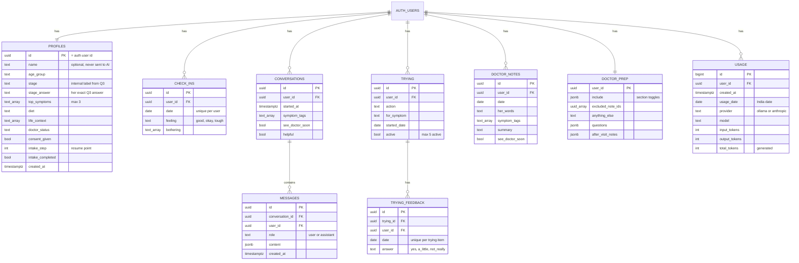

# LaterUp: 2-Day Build Spec

This file says **what** gets built by 8 October 2026 and **how**. The five page briefs in `docs/pages/` give the full detail and exact copy for each page. Rules for working are in `CLAUDE.md`.

> **Target audience:** Indian women aged 40 to 55, then South Asia, then global. Build for their real lives: Indian dietary options (vegetarian, eggetarian, Jain), joint families, caring for parents or in-laws, working and running a home. The brand stays global; the first audience is deliberately chosen, not a limitation.

**Where the page briefs and this spec differ:** the briefs were written for a no-login, browser-storage version. Wherever a brief says "saved on her device" or "browser storage", read "saved to her own rows in Supabase". Wherever it says "no login", read "login as in section 4". Everything else in the briefs (copy, safety rules, layouts, insight rules) stands.

---

## 1. Decisions, and why

| Area | Decision | Why |
|---|---|---|
| Name | **LaterUp** | One word reads as a brand, works as a logo and a web address |
| Login | **Email and password via Supabase, email confirmation OFF** | Mosaic asked for a web app, built properly. Browser-only storage is lost when she clears her cache or switches phone. The AI builds auth in minutes, so login no longer costs the build time it once did. Confirmation off means reviewers get in instantly, no inbox step |
| Database | **Supabase Postgres with Row Level Security on every table** | Her data survives cache clearing and works on any device. RLS guarantees each woman sees only her own rows, enforced by the database itself, not by app code |
| AI | **One "brain connector" file, two providers** | Local Qwen on the desktop during development (free, unlimited trial and error). Claude Haiku 4.5 for the live demo (reliable, always on, tight instruction-following). One environment variable flips between them; no code changes |
| Demo model | **Claude Haiku 4.5** at $1 / $5 per million input / output tokens | Cheapest current Claude model with strong instruction-following, which matters most for health safety rules. A whole demo costs a few cents |
| Admin | **No admin page. Use the Supabase dashboard** | Signups, test-account clean-up, caps and usage are all visible there. Hours saved go into the Talk page, which is what reviewers judge. Admin panel is listed as future work |
| Guardrails | **Section 9, all in one place** | Protects money, keeps the app on-topic, and shows reviewers the thinking behind it |
| Hero feature | **Talk page: she types in her own words, gets one warm 4-part answer** | Feeling understood is the differentiator |
| Timeline | **Build 6 and 7 Oct, submit 8 Oct** | Deadline |

---

## 2. Scope

| Tier | Item | Decision |
|---|---|---|
| Must | Sign up, Log in, Log out | Build |
| Must | Page 1: Welcome and Intake | Build |
| Must | Page 2: Home (check-in, "What you're trying" cards) | Build |
| Must | Page 3: Talk, with safety check, AI answer, pre-written fallback answers | Build, polish first |
| Must | Page 4: Patterns, with example mode | Build |
| Must | Page 5: Doctor Prep, with example mode, Show to doctor, Print | Build |
| Must | Settings: edit answers, privacy note, delete my data, log out | Build (small) |
| Must | All guardrails in section 9 | Build |
| Should | WhatsApp share and Copy on Doctor Prep | Build if Day 2 is on time |
| Should | After-visit notes on Doctor Prep | Build if Day 2 is on time |
| Should | 30-day toggle on Patterns | Build if Day 2 is on time |
| Cut | Password reset by email, social login | Future |
| Cut | Admin panel inside the app | Future (Supabase dashboard for now) |
| Cut | Full Hindi and other languages (only the doctor conversation starter is in Hindi) | Future |
| Cut | Community, articles, notifications, streaks | Not built |
| Cut | Workplace (B2B) version, payments | Future, mention in submission note |

---

## 3. Architecture



**Why this stack:** Next.js gives pages and server routes in one project. Supabase gives auth, a real database and row-level security on a free tier. Vercel gives a free public link and redeploys on every push. The only running cost is the AI call, bounded by the guardrails in section 9.

### 3.1 The brain connector (`lib/brain.ts`)

One file, one function. Every part of the app that needs the model calls only this:

```ts
askModel({ system, messages, maxTokens }) => {
  text, inputTokens, outputTokens, provider, model
}
```

Inside it, two small adapters:

| | Ollama (development) | Anthropic (demo) |
|---|---|---|
| Endpoint | `${OLLAMA_BASE_URL}/api/chat` | Anthropic Messages API |
| Model | `OLLAMA_MODEL` = `qwen3.8-q5-65k:latest` | `ANTHROPIC_MODEL` = `claude-haiku-4-5-20251001` |
| Turn off "Thinking" | `think: false` | not needed |
| Answer length wall | `options.num_predict: 300` | `max_tokens: 300` |
| Input tokens from | `prompt_eval_count` | `usage.input_tokens` |
| Output tokens from | `eval_count` | `usage.output_tokens` |

**Why one connector:** safety checks, formatting, fallbacks and usage tracking sit downstream and stay identical whichever model answered. Switching to Haiku is a one-line change in Vercel's environment variables.

**After switching to Haiku,** do one quality pass: ask the 10 most likely questions and read every answer. The two models have different personalities.

### 3.2 What `/api/understand` does, in order

1. Confirms she is logged in (reject otherwise).
2. Rejects messages over `MAX_MESSAGE_CHARS` (1,000).
3. Runs the emergency word check (same list as on the device, from `03-talk.md`). If it matches, returns the emergency response. Never calls the model, never saves, never counts against her cap.
4. Runs the off-topic check. Obvious off-topic requests get the warm redirect without calling the model.
5. Counts today's AI questions for her in `usage`. If at the daily cap, returns the warm limit message.
6. Calls `askModel` with the system prompt from `03-talk.md` plus the additions in section 9.4, her minimum profile fields (never her name) and the last 6 messages.
7. Validates the answer: valid JSON, no medicine names or doses, no diagnosis phrasing. If invalid, returns the fallback.
8. Inserts one row into `usage` with token counts (never the message text).
9. Returns the answer. Never logs message content.

**On the device, around the route:** emergency check and length check run first too (so obvious cases cost nothing and feel instant); if the route fails or takes over 15 seconds, show the pre-written answer or the gentle fallback.

### 3.3 Environment variables

| Variable | Where | Value / note |
|---|---|---|
| `NEXT_PUBLIC_SUPABASE_URL` | browser + server | from Supabase project settings |
| `NEXT_PUBLIC_SUPABASE_ANON_KEY` | browser + server | public-safe |
| `SUPABASE_SERVICE_ROLE_KEY` | **server only** | never in browser code, never prefixed `NEXT_PUBLIC_` |
| `AI_PROVIDER` | server | `ollama` locally, `anthropic` on Vercel |
| `OLLAMA_BASE_URL` | server | `http://192.168.1.4:11434` |
| `OLLAMA_MODEL` | server | `qwen3.8-q5-65k:latest` |
| `ANTHROPIC_API_KEY` | **server only** | from Anthropic console |
| `ANTHROPIC_MODEL` | server | `claude-haiku-4-5-20251001` |
| `MAX_MESSAGE_CHARS` | server | `1000` |
| `MAX_ANSWER_TOKENS` | server | `300` |

The signup cap and daily question cap live in the database (`app_config`), not here, so they can be changed from the Supabase dashboard without redeploying.

---

## 4. Login and user flow



- Welcome page shows **Let's begin** (sign up) and **I already have an account** (log in).
- Sign up asks only email and password. Name is asked later in intake, and is optional.
- Before showing the sign-up form, the app calls `signups_open()`. If false, show the "signups full" message instead of the form.
- Pages 2 to 5 and Settings require login. A logged-out visitor is sent to Welcome.
- Bottom navigation on Pages 2 to 5: **Home, Talk, Patterns, Doctor**. Icon and word on every tab.
- The Home-to-Talk question handover uses `sessionStorage`, never the URL.

---

## 5. Database (Supabase)

### 5.1 Tables



Plus one settings table with no user link:

| Table | Columns | Rows |
|---|---|---|
| `app_config` | `key text primary key`, `value int` | `max_signups = 5`, `daily_question_cap = 30` |

**Rules:**
- Every `user_id` references `auth.users(id) on delete cascade`, so deleting an account removes every row she owns.
- One check-in per user per date (`unique (user_id, date)`). Saving again updates it.
- One feedback per trying item per date (`unique (trying_id, date)`).
- Emergency messages are never inserted into `messages`.
- Example data lives in its own code file. It is **never** written to the database.

### 5.2 Row Level Security

Turn RLS **on** for every table. For each user table:

```sql
alter table check_ins enable row level security;
create policy "own rows only" on check_ins
  for all using (auth.uid() = user_id) with check (auth.uid() = user_id);
```

Same policy on `conversations`, `messages`, `trying`, `trying_feedback`, `doctor_notes`. For `profiles` and `doctor_prep` the key column is `id` / `user_id` respectively.

Special cases:

| Table | Policy | Why |
|---|---|---|
| `usage` | She may **select** her own rows. **No insert, update or delete policy**; only the server route (service role) writes | She cannot fake or erase her own usage |
| `app_config` | **No policies at all** | Only the server and the dashboard can read or change caps |

**Test before Day 2 ends:** log in as user A, then try to read user B's check-in by id. It must return nothing.

### 5.3 Signup cap (database-enforced)

```sql
create or replace function public.handle_new_user()
returns trigger language plpgsql security definer set search_path = public as $$
declare cap int; current_count int;
begin
  select value into cap from app_config where key = 'max_signups';
  select count(*) into current_count from auth.users;
  if current_count > cap then
    raise exception 'signups_full';
  end if;
  insert into profiles (id) values (new.id);
  return new;
end; $$;

create trigger on_auth_user_created
  after insert on auth.users
  for each row execute function public.handle_new_user();

create or replace function public.signups_open()
returns boolean language sql security definer set search_path = public as $$
  select (select count(*) from auth.users) < (select value from app_config where key = 'max_signups');
$$;
```

**Why in the database:** the cap holds even if someone bypasses the app's form. If the trigger refuses, the app shows the friendly "signups full" copy, never the raw error.

**Before submitting:** delete test accounts in the Supabase dashboard (Authentication, Users) so reviewers have free slots, or raise `max_signups` to 6 or 7.

---

## 6. Page summaries

Full detail and exact copy are in the briefs.

### Page 1: Welcome and Intake (`/`)
- Welcome: headline, sub line, "🔒 Private by design. Your words stay yours.", buttons **Let's begin** and **I already have an account**, link **How we protect you**.
- Sign up (email, password), then promises step: privacy promise, honesty promise, emergency box (112), required tick "I understand LaterUp is a prototype for demo and evaluation, and a wellness guide, not medical advice. I agree to the terms of use."
- 7 questions, one per screen, progress "2 of 7", Back, **Skip for now** on every question. Saves after each answer so she resumes where she stopped, on any device.
- Thank you screen reflecting her top symptoms, then Home.

### Page 2: Home (`/home`)
- Greeting by time and name ("Still awake, Meena?" late at night).
- Big box **What's on your mind?** with button **Help me understand**.
- 3 suggested questions from her top symptoms.
- One-tap check-in: Good, Okay, Tough, then optional symptoms.
- "You're trying" cards (max 2) with **Did it help?** Yes, A little, Not really.

### Page 3: Talk (`/talk`), the hero
- Emergency check first. Warning signs move the doctor card to the top.
- Every answer: "I hear you" line, **What's likely happening**, **One small thing to try** (with **I'll try this** and **More ideas**), **Talk to a doctor if**.
- Then **Add to my doctor notes**, Was this helpful?, 2 to 3 follow-up chips.
- A small "characters left" counter appears once she passes 800 characters.
- Gentle loading text, no spinner.
- **Pre-written answers for all 15 suggested questions** so the hero works even if the AI fails during review. These never count against her daily cap.

### Page 4: Patterns (`/patterns`)
- Dot row of good, okay and tough days with one plain summary sentence.
- **Something we noticed** (only with 7+ check-ins), labelled "a pattern from your check-ins, not a medical finding".
- **What's helping you** before **What's been bothering you**.
- Gentle support card in hard stretches, with Tele-MANAS 14416.
- Empty state with progress, and **See an example**.

### Page 5: Doctor Prep (`/doctor`)
- Reassurance line based on her doctor comfort answer.
- **Please mention these first** for warning-sign notes.
- Summary with include/exclude toggles, questions to ask (max 8), conversation starter in English and हिंदी, which doctor to see.
- **Show to doctor**, **Save as PDF / Print**, WhatsApp and Copy with privacy reminder.
- Example mode with sharing disabled.

### Settings (`/settings`)
- Edit my answers, How we protect you, **Delete my data** (calls `/api/delete-account`, confirms first, then signs out to Welcome), **Log out**.

---

## 7. Insight rules (honest personalisation)

Defined fully in `04-patterns.md`. Show one insight only when there are at least 7 check-ins in the period, in this priority:

1. **Something is helping:** a "trying" item with 4+ answers, 75% or more Yes or A little
2. **One symptom shapes the day:** tough-day share at least 30 points higher on days with that symptom, at least 3 days in each group
3. **Days are getting better:** at least 3 fewer tough days than the previous period
4. **Most common symptom:** tagged on 5+ days

Always use counts ("5 of 6"), never percentages. Never claim cause.

---

## 8. Making the demo work for reviewers (critical)

1. **Getting in is instant:** sign up with any email, no confirmation step, intake under 2 minutes, every question skippable.
2. **Talk always answers:** AI first; pre-written answers for the 15 suggested questions if the AI fails; a gentle fallback for anything else.
3. **Patterns and Doctor Prep look full:** **See an example** shows a clearly labelled sample story (Meena, 45 to 49, poor sleep and mood; "last chai before 4 pm + slow breathing" seemed to help on 4 of 5 days).
4. **Free signup slots:** clear test accounts before submitting.
5. In the submission note, suggest a path: "Sign up, tap a suggested question on Home, then open Patterns and tap See an example."

---

## 9. Safety, Privacy and Guardrails

This section gathers every protection in one place. It doubles as evidence of judgment for the submission note.

### 9.1 Money and abuse

| # | Guardrail | Setting | Where enforced | What she sees |
|---|---|---|---|---|
| 1 | Hard spend limit | Monthly limit in Anthropic console | Anthropic | Gentle fallback answer if ever reached |
| 2 | Signup cap | `max_signups = 5` in `app_config` | Database trigger | "LaterUp is in private preview, signups are currently full." |
| 3 | Daily AI questions per user | `daily_question_cap = 30` in `app_config`, counted from `usage` per India date | `/api/understand` | "You've asked a lot today, and that's okay. Let's carry on tomorrow. If something feels urgent or isn't settling, please talk to a doctor. Your Doctor Prep page has everything ready." |
| 4 | Message length | 1,000 characters | Device first, then route | "That's a lot to hold. Try sharing the one thing weighing on you most right now." |
| 5 | Answer length | About 150 words in the prompt, hard wall of 300 tokens | Prompt + brain connector | Nothing; answers stay short |
| 6 | Cooldown between questions | **Not built** | n/a | n/a |

**Why no cooldown:** a real user reads each answer before asking again, so she would never meet it. Spam is already bounded by the 5-account cap and 30 questions each. A cooldown would add code for almost no extra protection.

**What never counts against the daily cap:** emergency responses, pre-written answers, off-topic redirects decided on the device.

### 9.2 Usage tracking

Every model call writes one `usage` row: provider, model, input tokens, output tokens, total. Message text is never stored there.

**Why:** it shows exactly what each user costs, enforces the daily cap from real records, and works the same for Ollama and Haiku. Measuring during free local development shows what a typical question costs before any money is spent. If 30 questions turn out to cost very little, the cap can be raised with evidence instead of guesswork.

Useful dashboard query (SQL editor):

```sql
select user_id, usage_date, count(*) as questions,
       sum(input_tokens) as input_tokens, sum(output_tokens) as output_tokens,
       sum(total_tokens) as total_tokens
from usage group by user_id, usage_date order by usage_date desc;
```

### 9.3 Topic control (three layers)

1. **Device and route check** for obvious off-topic requests (write code, homework, essays, translations, general chat). Answered with the redirect, no model call, no cost.
2. **Model instruction:** only menopause, midlife and women's health; gently decline anything else.
3. **Warm wording, not a wall:** "I'm here for midlife and menopause questions. Is there something you're feeling I can help with?"

### 9.4 Additions to the system prompt in `03-talk.md`

Append these rules to the existing prompt:

- Keep the whole answer under about 150 words. Each of the four parts is 1 to 3 short sentences.
- Calm, one step at a time: if she asks several anxious questions at once or in quick succession, begin with a steadying line such as "Let's take this one step at a time, there's no rush", then answer the single most important concern. Offer the rest as follow-up chips.
- Only answer questions about menopause, midlife and women's health. For anything else, return the off-topic response shape with the redirect wording above.

### 9.5 Health safety

- No diagnosis, no stage labels, no "caused by menopause"; use "may be linked", "can play a part".
- No medicines, doses, supplements or hormone therapy advice; no cure claims; no promised outcomes.
- "Talk to a doctor if" on every answer.
- Emergency check on the device **and** in the route before any model call. Shows 112, and Tele-MANAS 14416 for self-harm. Never sent to the model, never saved, never blocked by any cap.
- Answers validated before showing: JSON shape, medicine names, doses, diagnosis phrasing.
- Patterns are observations, never causes. Never invent data.
- "LaterUp is a wellness guide, not medical advice." on every page.

### 9.6 Privacy and security

- Row Level Security on every table; tested with two accounts.
- Service role and model keys server-only; `.env.local` never committed.
- Her name is never sent to the model. The route never logs message content.
- No health details in URLs, page titles or tab names.
- Consent tick before intake; clear privacy note; Delete my data removes the account and every row.
- Sharing only on her tap, after a privacy reminder. Example data never shareable.

### 9.7 Graceful failure and accessibility

- Every failure shows a short human message and a way forward. Never technical error text.
- 18px body text, 48px tap targets, strong contrast, works on low-end phones.

---

## 10. Admin, via the Supabase dashboard

| Task | Where |
|---|---|
| See who signed up | Authentication, Users |
| Delete a test account (frees a slot, cascades all rows) | Authentication, Users, Delete |
| Change signup cap or daily question cap | Table editor, `app_config`, edit `value` |
| See usage and tokens | SQL editor, query in 9.2 |
| Inspect data | Table editor |

---

## 11. Setup checklist

Laptop:
1. Node.js (LTS), VS Code, Git, a GitHub account, Claude Code.

Supabase:
1. Create one project (free tier). This account owns LaterUp; users sign up inside the app, never in Supabase.
2. Authentication, Providers, Email: turn **Confirm email OFF**.
3. Run the SQL for tables, RLS policies, `app_config` rows and the signup trigger (Claude Code generates it from section 5).
4. Copy the URL, anon key and service role key into `.env.local`.

Anthropic:
1. Console: add $5 credit, **set a monthly spend limit**, create an API key.
2. Note: the Claude Pro subscription does not include API access; this is a separate wallet.

Vercel:
1. Sign in with GitHub, import the repo.
2. Add every variable from 3.3, with `AI_PROVIDER=anthropic`. Do not add `OLLAMA_BASE_URL`; Vercel cannot reach the desktop.

Claude Code skills (one time, in the VS Code panel):
1. Install Git (git-scm.com) and restart VS Code. Adding a marketplace needs Git.
2. Open Manage Plugins, Marketplaces tab, add `https://github.com/anthropics/claude-code.git` (shows as `claude-code-plugins`).
3. Plugins tab: install **frontend-design** from `claude-code-plugins` (the one whose source is Anthropic's GitHub). Start a new session so it loads. It applies automatically to all UI work.
4. `/simplify` is already built into Claude Code. Run it after each page to tidy the code just written.

Why: frontend-design stops the app looking generically AI-built, which reviewers notice first. `/simplify` keeps the code readable for a non-programmer builder.

Before the first push: check `.gitignore` includes `.env.local`.

---

## 12. Two-day plan

| When | Goal | Done when |
|---|---|---|
| Day 1 (6 Oct) | Project setup, Supabase tables + RLS + trigger, sign up / log in, design tokens, brain connector, Page 1, Page 2, Settings. Talk page with safety check and pre-written answers. **Deploy to Vercel tonight.** | A stranger can sign up on the live link, finish intake, check in, and get a pre-written answer |
| Day 2 (7 Oct) | `/api/understand` with all guardrails and usage tracking, I'll try this, doctor notes. Pages 4 and 5 with example modes. Switch Vercel to Haiku, quality pass. Phone testing. Clear test accounts. Submission note. **No new features after 6 pm.** | Full journey works on a phone on the live link |
| 8 Oct | Final check on a phone, submit | |

**Fallback if behind, cut in this order:** after-visit notes, WhatsApp share (keep Copy), 30-day toggle, Recent conversations list, Edit my answers. **Never cut:** login + RLS, safety checks, guardrails, pre-written answers, example modes, Show to doctor.

---

## 13. Suggested first prompts for Claude Code

1. "Read CLAUDE.md, docs/BUILD-SPEC.md and all files in docs/pages. Set up a new Next.js project with TypeScript and Tailwind, with the design tokens and fonts. Explain each step before you do it."
2. "Write the Supabase SQL for section 5: tables, RLS policies, app_config rows and the signup trigger. Then set up the Supabase client and sign up / log in screens."
3. "Create lib/brain.ts as described in section 3.1, with both adapters, and a tiny test page that sends 'hello' and shows the reply and token counts. Remove the test page afterwards."
4. "Build Page 1, Welcome and Intake. Then tell me how to test it."
5. "Help me push to GitHub and deploy to Vercel."
6. "Build Page 2, Home, and Settings."
7. "Build Page 3, Talk, with the safety check and pre-written answers first. Then add /api/understand with every guardrail in section 9."
8. Then Page 4, then Page 5, testing each before moving on.
9. After each page: run `/simplify`, then test again.

---

## 14. Submission note (outline)

- **What LaterUp is and who it serves**, in two lines.
- **The insight:** every woman goes through it, few talk about it, and existing apps are built for Western women and make her do the work.
- **What's different:** say it in your own words and feel understood; track what helps, not just symptoms; walk into the doctor's room prepared, in English or Hindi.
- **Why it fits Mosaic Wellness.**
- **Live link** and a suggested 2-minute path.
- **How it was built:** requirements first, then Claude Code, Next.js, Supabase and Vercel. Developed against a local open model for free iteration, shipped on Claude Haiku 4.5 through a single provider switch.
- **Safety, privacy and guardrails:** summarise section 9: no diagnosis, emergency check before any AI, RLS, signup and daily caps, usage tracking per user.
- **Scope choices:** 5 pages, what was cut and why.
- **What's next:** admin panel, password reset, full Hindi, freemium (LaterUp Plus), clinic partnerships, workplace version.

---

## 15. Local AI setup: Ollama in WSL, reachable from the laptop

The full, expanded version of this section, plus the VS Code and Claude Code setup, is in `docs/DEV-SETUP.md`.

**Why:** during development the Talk page uses the local Qwen model on the desktop (free). Ollama runs inside WSL on a private internal network (`172.17.x.x`) that no other machine can see. So Ollama must listen beyond itself, and Windows must pass traffic from its home-wifi address into WSL. Works on home wifi only; Vercel and the laptop away from home cannot reach it, which is why the provider switch exists.

| Item | Value |
|---|---|
| Desktop home-wifi address | `192.168.1.4` |
| WSL internal address (changes on reboot) | `172.17.164.243` at time of setup |
| Ollama port | `11434` |
| Model | `qwen3.8-q5-65k:latest` |
| Address the app uses | `http://192.168.1.4:11434` |

### Step 1: Ollama settings (permanent, in WSL)

Ollama runs as a background service, so settings go on the service, not in an `export`:

```bash
sudo systemctl edit ollama
```

Add, save and exit:

```ini
[Service]
Environment="OLLAMA_HOST=0.0.0.0"
Environment="OLLAMA_NUM_PARALLEL=2"
```

Then:

```bash
sudo systemctl daemon-reload
sudo systemctl restart ollama
sudo systemctl status ollama
```

`0.0.0.0` opens it to the home wifi only; the router still blocks the internet. `OLLAMA_NUM_PARALLEL=2` lets two people (desktop and laptop) be served side by side, so a long job on one machine does not block the other. The model weights load once and are shared.

**Memory note on parallel requests:** each parallel slot reserves its own context memory, and this model has a 65k context, so higher values reserve a lot of GPU memory. Start with 2. Run `ollama ps` while it is loaded: it should show `100% GPU`. If it shows a CPU share, lower `OLLAMA_NUM_PARALLEL`.

### Step 2: find the WSL address (PowerShell)

```powershell
wsl hostname -I
```

### Step 3: forward Windows traffic into WSL (PowerShell as Administrator)

```powershell
netsh interface portproxy add v4tov4 listenaddress=192.168.1.4 listenport=11434 connectaddress=172.17.164.243 connectport=11434
```

### Step 4: allow it through the firewall (PowerShell as Administrator)

```powershell
New-NetFirewallRule -DisplayName "Ollama 11434" -Direction Inbound -LocalPort 11434 -Protocol TCP -Action Allow -Profile Private
```

### Step 5: verify

```powershell
netsh interface portproxy show all
curl.exe http://192.168.1.4:11434
```

Expect "Ollama is running", then the same in the laptop's browser.

### Known catches

- **WSL address changes after a reboot.** Rerun Step 2, then:
  ```powershell
  netsh interface portproxy delete v4tov4 listenaddress=192.168.1.4 listenport=11434
  ```
  and redo Step 3 with the new address.
- **"address already in use" on `ollama serve`** means the service is already running. Use `systemctl` as in Step 1 instead of `ollama serve`.
- **Desktop address can change** if the router reassigns it. Check with `ipconfig` and update the rule and `OLLAMA_BASE_URL`.
- **`think: false`** is sent on every call from the brain connector, so the model skips its visible "Thinking..." step.
