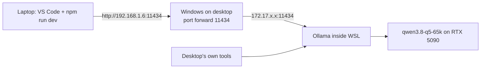

# LaterUp: Development Environment Setup

Two things are covered here, both done once:

1. **Local LLM access:** the laptop (where the app is built) uses the Qwen model running in Ollama on the desktop.
2. **VS Code and Claude Code setup:** Git, the plugin marketplace, the frontend-design skill and `/simplify`.

Product scope and build rules live in `BUILD-SPEC.md` and `CLAUDE.md`.

---

## Part 1: Local LLM access from the laptop

### 1.1 Why this exists

During development, the Talk page calls a local model instead of the paid Claude API. Trial and error costs nothing on the desktop's own GPU. For the live demo on Vercel, one setting switches the app to Claude Haiku 4.5, because Vercel cannot reach a home desktop.

### 1.2 How the pieces connect



**The problem it solves:** Ollama runs inside WSL, which sits on a private internal network (`172.17.x.x`) that only the desktop can see. Two fixes are needed: Ollama must accept connections from beyond itself, and Windows must pass traffic from its home-wifi address into WSL.

### 1.3 Reference values

| Item | Value |
|---|---|
| Desktop home-wifi address | `192.168.1.6` |
| WSL internal address (changes on reboot) | `172.17.164.243` at time of setup |
| Ollama port | `11434` |
| Model | `qwen3.8-q5-65k:latest` (about 21 GB) |
| Address the laptop and the app use | `http://192.168.1.6:11434` |

### 1.4 Desktop: Ollama settings (in WSL)

#### What we ran (tested, works)

In a WSL terminal on the desktop:

```bash
sudo systemctl stop ollama
export OLLAMA_HOST=0.0.0.0
export OLLAMA_NUM_PARALLEL=2
ollama serve
```

Leave this terminal open. Ollama runs as long as it stays open.

- `sudo systemctl stop ollama` stops the background copy of Ollama first. Without it, `ollama serve` fails with "address already in use". The password asked for is the **WSL Linux password** set when Ubuntu was installed, not the Windows password. Nothing shows on screen while typing it.
- Check the setting took with `echo $OLLAMA_HOST` in the same terminal. It should print `0.0.0.0`. Empty means it isn't set.
- If a model chat (`ollama run`) is open in that terminal, type `/bye` first to get back to the prompt.

**What each setting does, and why:**

- `OLLAMA_HOST=0.0.0.0` lets Ollama accept connections from other machines. It opens it to the **home wifi only**; the home router still blocks the internet.
- `OLLAMA_NUM_PARALLEL=2` lets two requests run side by side, so a long job on the desktop does not leave the laptop waiting in a queue. The 21 GB of model weights load once and are shared, so memory does not double.

**Memory caution:** each parallel slot reserves its own context memory, and this model has a 65k context. Higher values reserve a lot of GPU memory. With the model loaded, run `ollama ps` in another terminal. It should show `100% GPU`. If it shows any CPU share, lower `OLLAMA_NUM_PARALLEL`. Two is enough for two people.

**Limitation of this method:** `export` lasts only for that terminal. If the terminal closes or the desktop restarts, the background service starts again without these settings and the laptop loses access. Repeat the four commands above, or make it permanent below.

#### Optional: make it permanent (not yet done)

So the settings survive restarts and no terminal has to stay open, put them on the background service instead:

```bash
sudo systemctl edit ollama
```

In the editor that opens, add, save and exit:

```ini
[Service]
Environment="OLLAMA_HOST=0.0.0.0"
Environment="OLLAMA_NUM_PARALLEL=2"
```

Then:

```bash
sudo systemctl daemon-reload
sudo systemctl restart ollama
sudo systemctl status ollama
```

`status` should show "active (running)". After this, the four commands above are no longer needed.

### 1.5 Desktop: forward traffic into WSL (PowerShell)

**Find the WSL address** (normal PowerShell, not inside WSL):

```powershell
wsl hostname -I
```

Use the first number shown. Plain `hostname -I` in PowerShell fails, because Windows has its own different `hostname` command.

**Add the forward** (PowerShell as Administrator), using that number:

```powershell
netsh interface portproxy add v4tov4 listenaddress=192.168.1.6 listenport=11434 connectaddress=172.17.164.243 connectport=11434
```

**Allow it through the firewall** (PowerShell as Administrator):

```powershell
New-NetFirewallRule -DisplayName "Ollama 11434" -Direction Inbound -LocalPort 11434 -Protocol TCP -Action Allow -Profile Private
```

### 1.6 Verify

On the desktop (PowerShell):

```powershell
netsh interface portproxy show all
curl.exe http://192.168.1.6:11434
```

The first lists `192.168.1.6 11434 -> 172.17.164.243 11434`. The second prints "Ollama is running".

On the laptop: open `http://192.168.1.6:11434` in a browser. It should show "Ollama is running".

### 1.7 Laptop: point the app at the desktop

In the project's `.env.local` on the laptop:

```bash
AI_PROVIDER=ollama
OLLAMA_BASE_URL=http://192.168.1.6:11434
OLLAMA_MODEL=qwen3.8-q5-65k:latest
```

The brain connector (`lib/brain.ts`) sends `think: false` on every call, so the model skips its visible "Thinking..." step and answers faster.

On Vercel, set `AI_PROVIDER=anthropic` instead and do not add `OLLAMA_BASE_URL`.

### 1.8 Troubleshooting

| Symptom | Cause | Fix |
|---|---|---|
| Laptop stopped connecting after a desktop reboot | WSL address changed | Run `wsl hostname -I`, then delete and re-add the forward (below) |
| "address already in use" on `ollama serve` | Background service already running | Run `sudo systemctl stop ollama` first, as in 1.4 |
| `echo $OLLAMA_HOST` prints nothing | Not set in this terminal | Run the `export` lines in 1.4 in the same terminal as `ollama serve` |
| Laptop lost access after closing the terminal or restarting | `export` settings are gone | Repeat 1.4, or do the permanent option |
| Desktop works, laptop doesn't | Firewall rule missing, or wifi marked Public | Re-run the firewall rule; set the home wifi to Private in Windows settings |
| `192.168.1.6` no longer works | Router gave the desktop a new address | Check `ipconfig` on the desktop, update the forward and `OLLAMA_BASE_URL` |
| Works at home, not at college | Expected: home wifi only | Use `AI_PROVIDER=anthropic` when away from home |
| `ollma: command not found` | Typo | It's `ollama` |

**Replacing the forward after a WSL address change** (PowerShell as Administrator):

```powershell
netsh interface portproxy delete v4tov4 listenaddress=192.168.1.6 listenport=11434
netsh interface portproxy add v4tov4 listenaddress=192.168.1.6 listenport=11434 connectaddress=<new WSL address> connectport=11434
```

**Simpler long-term alternative:** run Ollama on Windows directly instead of inside WSL. It then listens on `192.168.1.6` natively and the port forward is no longer needed, so reboots stop breaking it.

### 1.9 Handy Ollama commands

| Command | What it does |
|---|---|
| `ollama list` | Models downloaded |
| `ollama ps` | Models loaded right now, and GPU vs CPU share. Empty just means nothing is loaded; Ollama unloads after idle and reloads on demand |
| `ollama run qwen3.8-q5-65k:latest` | Chat with the model in the terminal; `/bye` to exit |

---

## Part 2: VS Code and Claude Code setup

### 2.1 What gets installed, and why

| Item | Why |
|---|---|
| **Git** | Needed to add a plugin marketplace (it downloads from GitHub), and for committing the project |
| **frontend-design** skill | Without it, AI-built interfaces look generic (purple gradients, default fonts, plain cards). It gives Claude Code a proper sense of design before it writes UI, which is what reviewers notice first |
| **`/simplify`** | Built into Claude Code. Reviews the code just written and tidies it, so a non-programmer builder gets cleaner, more readable code |

A skill is a small folder of reusable instructions that teaches Claude Code to do one job well every time, without re-explaining it.

### 2.2 Steps

1. **Install Git** from git-scm.com. Restart VS Code afterwards. Check in PowerShell with `git --version`.
2. In the Claude Code panel in VS Code, open **Manage Plugins**.
3. **Marketplaces** tab: in the "GitHub repo, URL, or path" box, enter the marketplace address, not a plugin name, and click **Add**:
   ```
   https://github.com/anthropics/claude-code.git
   ```
   It appears as `claude-code-plugins`.
4. **Plugins** tab: search `frontend-design`. Two results appear. Install the one **from `claude-code-plugins`**, whose source link points to Anthropic's GitHub (`anthropics/claude-code`). Leave the other one alone; two overlapping design skills would conflict.
5. Confirm it shows under **Installed** as `frontend-design@claude-code-plugins` with the toggle on.
6. Close the window and click **New session** so the skill loads. It then applies automatically to all UI work.
7. `/simplify` needs no install. Type `/simplify` in the chat box after each page is built, then test again.

### 2.3 What not to install

Searching "simplify" in the Plugins tab shows `frontier-simplify`, `sol-simplify` and `prepare-delivery`. **Skip all three.** The first two are written for other AI models. `prepare-delivery` is a heavier pre-launch tool, more than a two-day demo needs, and has not been vetted. The built-in `/simplify` already covers the need.

Testing (the `webapp-testing` skill) is deferred; add it later if there is time.

### 2.4 Gotchas met during setup

| What happened | Why | What works instead |
|---|---|---|
| `/plugin` in the VS Code panel: "isn't available in this environment" | Slash plugin commands only work in the terminal version of Claude Code | Use the **Manage Plugins** window |
| `claude` in PowerShell: "not recognized" | Only the VS Code extension is installed, not the terminal tool | Use the Manage Plugins window. Optional: install the terminal tool with `irm https://claude.ai/install.ps1 \| iex` |
| Marketplaces tab: "No marketplaces configured" after clicking Add | A plugin name was typed instead of a marketplace address, and Git was not installed | Install Git, restart VS Code, enter the `.git` address in step 3 |

### 2.5 Optional fallback: install a skill without the marketplace

If the marketplace ever fails, ask Claude Code in the chat:

> Download the frontend-design skill's SKILL.md from the GitHub repo anthropics/claude-code (folder plugins/frontend-design/skills/frontend-design) and save it as C:\Users\Satpal\.claude\skills\frontend-design\SKILL.md. Then confirm the skill is available.

### 2.6 Working layout

- **Screen 1:** VS Code with Claude Code.
- **Screen 2:** browser at `http://localhost:3000` after running `npm run dev`. It reloads on every change.
