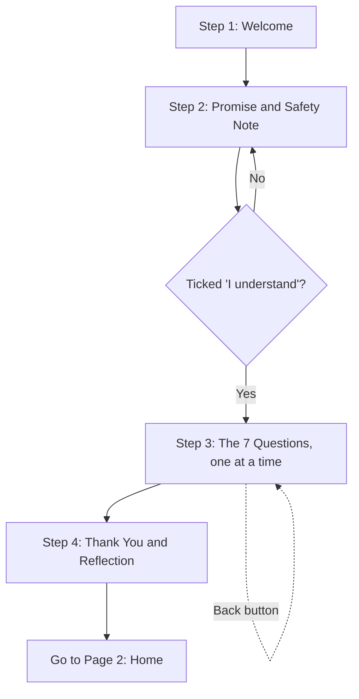

# LaterUp: Page 1, Welcome and Intake

**Product:** LaterUp, a private, personalized menopause and midlife wellness companion, built India-first
**Page:** 1 of 5
**Document type:** Page requirements brief (user story format)
**Who this is for:** Anyone building this page: a developer, a designer, or an AI coding agent

---

## 1. The page in one sentence

This is the first thing a woman sees: a warm welcome, a clear promise that her information is private, an honest note that LaterUp is not a doctor, and seven short questions that help the app get to know her, so that every screen after this one feels like it was made for her.

---

## 2. Why this page matters

Most health apps start with a sign-up form. That feels cold, and for a topic as personal as menopause, it can make a woman close the app before she even starts.

LaterUp starts differently. In about 90 seconds, it should make her feel three things:

1. **"This place is safe."** Her words stay private, and nobody is judging her.
2. **"This app is honest."** It tells her clearly what it can and cannot do.
3. **"This app gets me."** The questions sound like a caring friend, not a hospital form.

**Why it matters for the business:** the answers she gives here are the "personalization map." They quietly power the Home screen (Page 2), the Understanding screen (Page 3), the Patterns screen (Page 4) and the Doctor Prep screen (Page 5). If this page is skipped or done badly, the whole app feels generic, and LaterUp's biggest advantage over a free AI chatbot (it remembers her) disappears.

---

## 3. Who she is

**Primary user:** an Indian woman, roughly 40 to 55 years old, in perimenopause or menopause.

What she is probably feeling when she opens LaterUp:

- Confused about changes in her body, mood or sleep
- Worried something is wrong with her
- Embarrassed to talk about it, even with family
- Busy with work, home, children, parents or in-laws
- Not sure if it is "serious enough" to see a doctor
- Possibly not very comfortable with apps

**Design rule that comes from this:** if her mother or her aunt could use this page without help, it is good. If it needs explaining, it is too complicated.

---

## 4. User stories

Each story follows the format: *As a [user], I want [something], so that [reason].* Under each story are **acceptance criteria**: simple checks that tell the builder the story is done.

### Story 1: Feeling welcome

> As a woman opening LaterUp for the first time, I want a calm, warm welcome, so that I feel comfortable instead of nervous.

**Done when:**
- The first screen shows the LaterUp name, one short welcome line, and one button to begin
- There is no sign-up, login, email or password anywhere on this page
- The screen has lots of empty space and nothing that moves or flashes

### Story 2: Trusting my privacy

> As a woman sharing very personal things, I want to know my information stays private, so that I can be honest.

**Done when:**
- The privacy promise is visible on the welcome screen without scrolling
- It is written in plain words, not legal language
- She can tap "How we protect you" to read a short, simple explanation
- No personal information leaves her device in this version (see Section 9)

### Story 3: Knowing what LaterUp is, and is not

> As a woman looking for answers, I want to know honestly what LaterUp can and cannot do, so that I trust it and know when to see a real doctor.

**Done when:**
- A short, warm note says LaterUp helps her understand her body but is not a doctor
- She must tick one checkbox saying she understands, before the questions begin
- The note includes what to do in an emergency

### Story 4: Being asked, not interrogated

> As a woman who is tired and busy, I want a few quick, easy questions, so that I can get started without effort.

**Done when:**
- There are exactly 7 questions
- Only one question is shown at a time
- Most questions are answered by tapping, not typing
- A progress bar shows how far along she is (for example, "3 of 7")
- The whole intake takes under 2 minutes

### Story 5: Being understood as an Indian woman

> As an Indian woman, I want questions that fit my real life, so that the advice I get later fits my food, family and routine.

**Done when:**
- The food question includes Indian options such as vegetarian, eggetarian and Jain
- The life question includes joint family and caring for parents or in-laws
- Nothing on the page assumes a Western lifestyle

### Story 6: Not being forced

> As a woman who may not want to answer everything, I want to skip questions, so that I stay in control.

**Done when:**
- Every question except the consent checkbox has a "Skip for now" link
- Skipping never shows an error or a warning
- She can go back to any earlier question and change her answer

### Story 7: A gentle handover

> As a woman who has just finished the questions, I want a warm "thank you" moment, so that I feel heard before the app starts helping me.

**Done when:**
- A short closing screen reflects back one or two things she shared, in kind words
- One button takes her to the Home screen (Page 2)

---

## 5. The flow of this page

Page 1 is one page with several small steps inside it. She moves forward one step at a time.



**Returning user rule:** if she has already finished Page 1 before, the app skips straight to Page 2 (Home). She should never have to answer the questions twice.

---

## 6. Step by step: exactly what she sees

### Step 1: Welcome

**Purpose:** first impression. Calm, warm, safe.

**On the screen, top to bottom:**

1. **LaterUp logo/wordmark** at the top, centred
2. **A soft illustration or shape**, optional, simple and abstract (for example, a rising sun shape in terracotta). No photos of women, no stock images, no pink flowers.
3. **Headline:**
   > Midlife is a new chapter. You don't have to figure it out alone.
4. **Sub line:**
   > LaterUp helps you understand what your body is going through, find small things that help, and know when to see a doctor.
   > For women in the years before, during and after menopause.
5. **Privacy line** (small, with a lock icon):
   > 🔒 Private by design. Your words stay yours.
6. **Main button:** `Let's begin`
7. **Small link under the button:** `How we protect you`

**Why this wording:** "a new chapter" ties to the meaning of the name (later chapter, rising up). "You don't have to figure it out alone" speaks directly to the core problem: women don't talk about menopause.

### Step 2: Our Promise and Safety Note

**Purpose:** build trust before asking anything personal. This step is required and cannot be skipped.

**On the screen:**

**Heading:**
> Before we start, two promises

**Promise 1: Your privacy**
> Everything you share stays on this device. We don't ask for your phone number or email. We never sell or share your information. You can delete everything at any time.

**Promise 2: Honesty**
> LaterUp helps you understand your body and prepare for conversations with your doctor. It is not a doctor, and it does not diagnose or prescribe. For any medical decision, please talk to a qualified doctor.

**Emergency box** (soft red-clay border, always visible on this step):
> If you ever have severe chest pain, very heavy bleeding, fainting, or thoughts of harming yourself, please contact a doctor or emergency services right away. In India, you can call 112.

**Checkbox (required):**
> ☐ I understand LaterUp is a prototype for demo and evaluation, and a wellness guide, not medical advice. I agree to the terms of use. (7 Oct: changed at the user's request; "terms of use" links to Help)

**Button:** `Continue` (stays greyed out until the box is ticked)

**Why this matters:** Mosaic is a real health company. Showing that you understand the line between wellness and medicine, and that you protect data, signals maturity. Many student projects skip this.

### Step 3: The 7 Questions

**General rules for all 7 questions:**
- One question per screen
- Progress bar at the top: "Question 2 of 7"
- `Back` arrow at top left
- `Skip for now` link under the options
- Tapping an option highlights it in teal; a `Next` button appears
- For multi-choice questions, the limit is shown clearly ("Pick up to 3")
- Tone is like a friend asking, never like a hospital form

Below is each question with exact wording, options, and why we ask it.

---

#### Question 1: Her name

> What would you like us to call you?

- Type: short text box, optional
- Placeholder: `Your first name or a nickname`
- Helper text: `This is just for us to greet you. It stays on your device.`

**Why we ask:** so the Home screen can say "Good morning, Meena" instead of "Good morning, user." Small, but it makes the app feel personal.

---

#### Question 2: Her age

> Which age group are you in?

- Type: tap one
- Options:
  - Under 40
  - 40 to 44
  - 45 to 49
  - 50 to 54
  - 55 or above

**Why we ask:** what is "normal" changes with age. For example, menopause before 40 is something a doctor should know about, so the Understanding screen can gently mention it.

**Special rule:** if she picks "Under 40", the closing screen (Step 4) adds one gentle line: *"Changes like these before 40 are worth mentioning to a doctor. We'll help you prepare."*

---

#### Question 3: Where she is in the journey

> Which of these sounds most like you right now?

- Type: tap one
- Options:
  - My periods are still regular, but I've noticed other changes
  - My periods have become irregular
  - My periods stopped less than a year ago
  - My periods stopped more than a year ago
  - I'm not sure

**Why we ask:** this tells the app if she is likely in perimenopause, menopause or after menopause, without using medical words that might confuse her. "I'm not sure" is a completely valid answer and should be treated kindly.

**Note for the builder:** do NOT show the words "perimenopause" or "postmenopause" as the options. Store them internally as stage labels (see Section 8).

---

#### Question 4: What she is feeling most

> What's been bothering you most lately?
> Pick up to 3

- Type: tap up to 3
- Options (shown as soft rounded tags):
  - Hot flashes or night sweats
  - Poor sleep
  - Mood swings or irritability
  - Anxiety or feeling low
  - Forgetfulness or brain fog
  - Tiredness or low energy
  - Joint or body aches
  - Weight changes
  - Irregular or heavy periods
  - Headaches
  - Hair or skin changes
  - Discomfort during intimacy
  - Something else

**Why we ask:** this is the most important question. It decides what Home shows first, what the Understanding screen focuses on, and what the Patterns screen tracks.

**Why "up to 3":** asking for everything feels overwhelming. Three keeps it focused and tells us what matters most to her.

---

#### Question 5: Her food habits

> How do you usually eat?

- Type: tap one
- Options:
  - Vegetarian
  - Eggetarian
  - Non-vegetarian
  - Jain
  - Vegan
  - Prefer not to say

**Why we ask:** this is one of LaterUp's India-first advantages. When the app suggests "one small thing to try" (for example, foods for bone strength or better sleep), it should suggest things she actually eats, like ragi, curd, til or dal, not salmon and kale.

---

#### Question 6: Her daily life

> What does your life look like these days?
> Pick all that apply

- Type: tap any number
- Options:
  - I work outside the home
  - I work from home
  - I manage the home full time
  - I live in a joint family
  - I care for parents or in-laws
  - I have children at home
  - I live alone
  - Prefer not to say

**Why we ask:** Indian women often carry heavy family and caregiving duties. That affects stress, sleep and how much time she has for herself. Suggestions later can be realistic, for example "a 5-minute breathing break" instead of "an hour of yoga."

---

#### Question 7: Talking to a doctor

> Have you spoken to a doctor about these changes?

- Type: tap one
- Options:
  - Yes, I'm seeing a doctor for this
  - I've mentioned it, but didn't get much help
  - Not yet
  - I'm not comfortable talking about it

**Why we ask:** this tells the app how to handle the "see a doctor" part. If she is not comfortable, the app can be extra gentle and the Doctor Prep screen (Page 5) becomes even more valuable, because it gives her the words she needs.

---

### Step 4: Thank You and Reflection

**Purpose:** the first small "wow." She has just shared something personal; the app shows it listened.

**On the screen:**

**Headline** (uses her name if given):
> Thank you, Meena.

**Reflection line** (built from her answers, see logic below):
> You mentioned poor sleep and mood swings. Many women go through this in midlife, and you're not alone in it. Let's take it one step at a time.

**Button:** `Take me to LaterUp`

**How the reflection line is built:**

| Her answers | What the screen says |
|---|---|
| Picked 1 to 3 symptoms | "You mentioned [symptom 1] and [symptom 2]. Many women go through this in midlife, and you're not alone in it." |
| Skipped the symptom question | "Whatever you're going through, many women feel it too, and you're not alone." |
| Picked "Not comfortable talking about it" (Q7) | Add: "Whenever you're ready, we'll help you find the words for your doctor." |
| Picked "Under 40" (Q2) | Add: "Changes like these before 40 are worth mentioning to a doctor. We'll help you prepare." |
| No name given | Headline becomes "Thank you for sharing." |

Keep the final text to 3 short sentences at most.

---

## 7. Look and feel

### Colours

| Role | Colour | Hex | Where to use it |
|---|---|---|---|
| Background | Warm cream | `#FAF5EE` | Main page background |
| Surface | Soft sand | `#F1E7DA` | Cards, option tags, boxes |
| Accent | Terracotta | `#C2673F` | Logo, icons, small highlights, progress bar |
| Action | Deep teal | `#1F5C5A` | Main buttons, selected options |
| Gentle touch | Clay rose | `#D49A89` | Emergency box border, soft decoration |
| Main text | Warm charcoal | `#2E2A26` | Headlines and body text |
| Soft text | Muted brown-grey | `#6B625A` | Helper text, small notes |

**Why these colours:** cream and terracotta feel warm and Indian (think clay, earth and sunlight) without being loud. Teal adds calm and trust. We avoid bright pink on purpose, because the whole category uses it and LaterUp wants to stand apart.

**Rule:** white text only on deep teal buttons. Do not put white text on terracotta, because it is harder to read.

### Fonts

- **One font family only:** `DM Sans` (free on Google Fonts), with a fallback of `system-ui, sans-serif`
- Headlines: 26 to 30 px, semi-bold
- Body text: **18 px minimum** (larger than usual, because many women in their 40s and 50s find small text hard to read)
- Helper text: 15 px minimum
- Line spacing: generous (1.5 to 1.6)

### Shapes and spacing

- Rounded corners on buttons, cards and option tags (12 to 16 px)
- Big tap areas: every button and option at least 48 px tall
- Lots of empty space between elements
- No more than one main button per screen

### Tone of voice

| Do | Don't |
|---|---|
| "Many women go through this" | "You are suffering from" |
| "Let's take it one step at a time" | "Complete your profile" |
| "Skip for now" | "Required field" |
| "You're not alone in it" | "Symptom severity: high" |
| Short, warm sentences | Medical jargon or long paragraphs |

---

## 8. What the page saves (for the builder)

All answers are saved **only in the browser on her device** (for example, using localStorage). Nothing is sent to a server in this version.

Suggested structure:

```json
{
  "profile": {
    "name": "Meena",
    "ageGroup": "45-49",
    "stage": "perimenopause",
    "stageAnswer": "My periods have become irregular",
    "topSymptoms": ["poor_sleep", "mood_swings"],
    "diet": "vegetarian",
    "lifeContext": ["joint_family", "cares_for_elders"],
    "doctorStatus": "not_comfortable",
    "consentGiven": true,
    "consentDate": "2026-10-05",
    "intakeCompleted": true
  }
}
```

**How Q3 answers map to a stage label:**

| Her answer | Saved stage label |
|---|---|
| Regular periods, other changes | `early_perimenopause` |
| Irregular periods | `perimenopause` |
| Stopped less than a year ago | `late_perimenopause` |
| Stopped more than a year ago | `postmenopause` |
| Not sure | `unsure` |

**Why save only on the device:** it keeps her data private, it matches the promise on Step 2, and it means no login is needed. A real future version would add secure accounts, but for this assignment, on-device storage is honest, simple and safe.

**How other pages use this data:**

| Page | Uses |
|---|---|
| Page 2: Home | Name for the greeting, top symptoms to suggest first topics |
| Page 3: Understanding | Age, stage, symptoms, diet and life context to personalize every answer |
| Page 4: Patterns | Top symptoms as the default things to track |
| Page 5: Doctor Prep | Everything, to build the summary for her doctor |

---

## 9. Privacy and safety rules (must follow)

1. **No login, no email, no phone number** on this page or anywhere in this version
2. **Nothing leaves the device** from this page
3. **Consent checkbox is required** before any question is asked
4. **Emergency box** is shown on Step 2
5. **No diagnosing words** anywhere: no "you have," "disorder," "disease" or "abnormal"
6. **"How we protect you"** link opens a short pop-up with these four points:
   - Your answers are saved only on this device
   - We don't collect your name, number or email for any account
   - We never sell or share your information
   - You can delete everything from Settings at any time
7. **A "Delete my data" option** must exist somewhere in the app (Settings), which clears everything and returns her to Step 1

---

## 10. Accessibility (making it easy for everyone)

- Text size 18 px or larger for body text
- Strong contrast between text and background
- Every button and option can be reached using a keyboard
- Every icon has a text label for screen readers
- Works well on a phone first (most Indian users will open it on a phone), then on a laptop
- No timers, no auto-advancing screens; she moves at her own pace

---

## 11. Special situations

| Situation | What should happen |
|---|---|
| She closes the app halfway through the questions | Her answers so far are saved. Next time, she continues from where she stopped. |
| She skips every question | She still reaches Page 2. The app works in a general way and gently invites her to personalize later. |
| She taps Back on Question 1 | Goes back to Step 2 (the promises). |
| She has already finished Page 1 before | App opens directly on Page 2 (Home). |
| She wants to change her answers later | A "Edit my answers" option in Settings brings her back to the questions with her old answers already selected. |
| She types a very long name | Limit to 30 characters. |

---

## 12. Not included in this version (on purpose)

Keeping scope tight is how a two-day build stays polished. These are left out deliberately and can be mentioned in the submission note as future plans:

- Accounts, login and cloud sync
- Hindi and other Indian languages (planned next, because it widens reach)
- Connecting to wearables or health apps
- Workplace (B2B) version
- Payments and premium features

---

## 13. Final checklist before calling Page 1 done

- [ ] Welcome screen shows name, headline, privacy line and one button
- [ ] No sign-up, login, email or phone anywhere
- [ ] Promise and Safety Note step with required checkbox and emergency box
- [ ] Exactly 7 questions, one per screen, with progress bar
- [ ] Every question (except consent) can be skipped
- [ ] Back button works on every question
- [ ] Indian food and family options are present
- [ ] Thank You screen reflects her answers in kind words
- [ ] Answers saved only on the device
- [ ] Returning users skip straight to Home
- [ ] Colours, fonts and 18 px body text applied
- [ ] Works smoothly on a phone screen
- [ ] No medical diagnosis words anywhere

---

**Next:** Page 2, Home.
