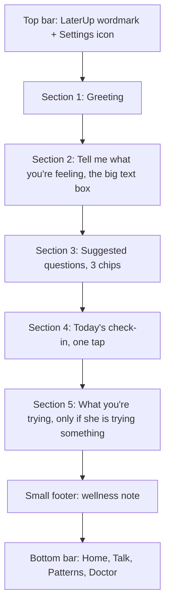
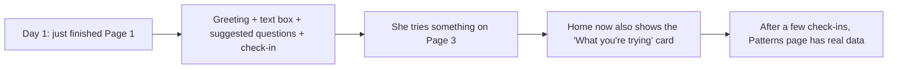

# LaterUp: Page 2, Home

**Product:** LaterUp, a private, personalized menopause and midlife wellness companion, built India-first
**Page:** 2 of 5
**Document type:** Page requirements brief (user story format)
**Who this is for:** Anyone building this page: a developer, a designer, or an AI coding agent
**Depends on:** Page 1 (Welcome and Intake) for her name, symptoms and other answers

---

## 1. The page in one sentence

Home is a calm, simple screen that greets her by name and makes one thing very easy: telling LaterUp what she is feeling right now, in her own words, with a tiny one-tap daily check-in and a gentle reminder of anything she is trying.

---

## 2. Why this page matters

This is the screen she will see every time she opens LaterUp. Most health apps put a busy dashboard here: charts, scores, streaks, articles. For a tired, worried woman, that feels like homework.

LaterUp's Home does the opposite. It has **one main job**: get her to the Understanding screen (Page 3, the hero) in one tap. Everything else on this page is small and quiet.

**Why it matters for the business:** this page answers the question we discussed earlier, "why would she come back every day?" She comes back because:

1. It takes **one tap** to check in (no forms)
2. It **remembers what she is trying** and asks if it helped
3. It always has a **door open** for whatever is worrying her today

Trust first, light habit second. That is the strategy, and Home is where it lives.

---

## 3. Who she is on this screen

The same woman from Page 1, but now in one of two moods:

- **The worried moment:** something just happened (a hot flash at work, crying for no reason, a sleepless night) and she wants to understand it now
- **The quiet check-in:** nothing urgent, she just opens the app for a moment

Home must work for both. The worried woman must reach the hero in one tap. The quiet woman must be able to check in and leave in 10 seconds.

---

## 4. User stories

### Story 1: Feeling greeted, not processed

> As a woman opening LaterUp, I want to be greeted warmly by name, so that it feels like a friend, not a system.

**Done when:**
- The greeting uses her name from Page 1 (or a kind greeting without a name if she skipped it)
- The greeting changes with the time of day
- There are no numbers, scores or charts at the top of the screen

### Story 2: Saying what I feel, right away

> As a woman who is worried about something right now, I want one obvious place to type what I'm feeling, so that I can get an answer without searching.

**Done when:**
- A large, friendly text box is the biggest thing on the screen
- Tapping "Send" takes her to Page 3 with her words already filled in
- She never has to pick a category or topic first

### Story 3: Not knowing what to ask

> As a woman who doesn't know how to put it into words, I want a few example questions, so that I can just tap one.

**Done when:**
- 3 suggested questions appear under the text box as tappable chips
- They are based on the top symptoms she chose on Page 1
- Tapping one takes her to Page 3 with that question filled in

### Story 4: A quick check-in

> As a busy woman, I want to tell the app how I'm feeling today with one tap, so that it learns my patterns without effort.

**Done when:**
- She can choose one of three feelings: Good, Okay, Tough
- After tapping, she can optionally tap what is bothering her today
- The whole check-in takes under 10 seconds
- Once done, it shows a short "thank you" and does not ask again that day

### Story 5: Remembering what I'm trying

> As a woman trying a small change, I want the app to ask me if it helped, so that I can find out what actually works for me.

**Done when:**
- If she chose to try something on Page 3, a small card shows it on Home
- The card asks "Did it help?" with three answers: Yes, A little, Not really
- Her answers are saved and shown later on Page 4 (Patterns)

### Story 6: Moving around easily

> As a woman who isn't very comfortable with apps, I want simple navigation, so that I never feel lost.

**Done when:**
- A bottom bar shows 4 clearly labelled tabs with icons and words
- A settings icon at the top lets her edit answers, read the privacy promise, or delete her data

---

## 5. The layout, top to bottom



**Rule:** Sections 1 and 2 must both be visible on a phone screen without scrolling. The text box is the hero of this page.

---

## 6. Section by section: exactly what she sees

### Top bar

- **Left:** LaterUp wordmark (small, terracotta)
- **Right:** Settings icon (gear), with the label "Settings" for screen readers

Tapping Settings opens a simple page with:
- `Edit my answers` (goes back to the Page 1 questions with her answers pre-selected)
- `How we protect you` (same privacy pop-up as Page 1)
- `Delete my data` (asks "Are you sure? This will remove everything and can't be undone." then clears everything and returns to Page 1, Step 1)

---

### Section 1: Greeting

**Main line** (changes by time of day, uses her name):

| Time on her phone | Greeting |
|---|---|
| 5:00 am to 11:59 am | Good morning, Meena |
| 12:00 pm to 4:59 pm | Good afternoon, Meena |
| 5:00 pm to 9:59 pm | Good evening, Meena |
| 10:00 pm to 4:59 am | Still awake, Meena? |

If she did not give a name, drop the name: "Good morning."

**Why "Still awake?" at night:** poor sleep is one of the most common midlife complaints. Many women will open this app at 2 am. Gently noticing that feels human.

**Second line** (one short sentence, picked by situation):

| Situation | Second line |
|---|---|
| First visit after Page 1 | "This is your space. Ask anything, there's no wrong question." |
| Yesterday's check-in was "Tough" | "Yesterday felt hard. How are you today?" |
| She is trying something (Section 5 is shown) | "Let's see how your small change is going." |
| Opened between 10 pm and 5 am | "Can't sleep? Tell me what's on your mind." |
| Any other day | "How are you feeling today?" |

If more than one applies, use the first match from top to bottom in this table.

---

### Section 2: Tell me what you're feeling (the hero of this page)

**Heading:**
> What's on your mind?

**Large text box:**
- At least 3 lines tall
- Placeholder text (in soft grey):
  > Say it in your own words. For example: "I can't sleep and I've been snapping at everyone."
- Soft sand background, rounded corners, no harsh border

**Button** (deep teal, full width under the box): `Help me understand`

**Rules:**
- The button stays disabled until she types at least a few characters
- Tapping it opens Page 3 with her text already sent
- Her text should not be cleared if she comes back to Home without finishing
- Small helper text under the button:
  > 🔒 Only you can see this.

**Why the wording "Help me understand":** it matches the core promise of LaterUp. Not "Submit," not "Ask AI," not "Chat." She is asking to understand her own body.

---

### Section 3: Suggested questions

**Small heading:**
> Not sure where to start?

**3 tappable chips** based on her top symptoms from Page 1. Tapping a chip goes straight to Page 3 with that question.

**Which questions to show:**

| Her top symptom (Page 1, Q4) | Suggested question |
|---|---|
| Hot flashes or night sweats | Why do I suddenly feel so hot? |
| Poor sleep | Why can't I sleep through the night anymore? |
| Mood swings or irritability | Why do I get angry so easily these days? |
| Anxiety or feeling low | Is it normal to feel anxious for no reason? |
| Forgetfulness or brain fog | Why am I forgetting small things? |
| Tiredness or low energy | Why am I tired all the time? |
| Joint or body aches | Can menopause cause body pain? |
| Weight changes | Why am I gaining weight around my stomach? |
| Irregular or heavy periods | Is it normal for my periods to change like this? |
| Headaches | Why am I getting more headaches? |
| Hair or skin changes | Why is my hair thinning? |
| Discomfort during intimacy | Is discomfort during intimacy common at this age? |

**If she picked fewer than 3 symptoms or skipped**, fill the remaining spots from this general list, in order:
1. What is perimenopause, in simple words?
2. When should I see a doctor?
3. How do I talk to my family about this?

**Why the third general question matters:** it reflects the Indian context directly. Many women live in joint families and find it hard to explain what they are going through. This one question quietly shows the reviewers that LaterUp understands that.

---

### Section 4: Today's check-in

**Heading:**
> How's today?

**Three large buttons in a row**, each with a simple icon and a word:

| Button | Icon idea | Saved as |
|---|---|---|
| Good | Small sun | `good` |
| Okay | Half sun / cloud | `okay` |
| Tough | Cloud | `tough` |

Use soft shapes, not cartoon faces. No emojis that look childish.

**After she taps one**, a small follow-up appears below (optional):
> Anything bothering you today? Tap any.

- Shows her top symptoms from Page 1 as small chips (up to 3), plus `Something else`
- She can tap any number, or none
- A small `Done` button saves it

**After saving**, the section changes to:
> Thanks for checking in. 🌿
> `Change` (small link, lets her edit today's check-in)

**Rules:**
- Only one check-in per day. If she taps again, it updates today's check-in instead of adding a new one.
- If she taps "Tough," show one extra gentle line under the thank you:
  > Tough days happen. Want to talk about it?
  with a small link that scrolls up and focuses the text box in Section 2.

**Why this matters:** these daily taps are what power Page 4 (Patterns). It is how LaterUp learns her patterns without ever asking her to fill a form.

---

### Section 5: What you're trying (only shown if she is trying something)

On Page 3, after she gets an answer, she can tap `I'll try this` on a suggestion. That suggestion appears here.

**Card layout:**

> **You're trying:** Drinking a glass of warm milk with a pinch of haldi before bed
> For: Poor sleep · Started 3 days ago
>
> **Did it help last night?**
> `Yes` `A little` `Not really`

**Rules:**
- Show at most **2** cards. If she is trying more, show the 2 newest and a small link `See all in Patterns`
- She can answer once per day per card
- After answering, the card shows: "Noted. We'll show you how it's going in Patterns."
- Each card has a small `Stop trying this` option (three-dot menu or small text link). Stopping removes it from Home but keeps its history for Patterns.
- If she has not answered for 3 days in a row, the card stays but does not nag. No pop-ups, no notifications.

**Why this matters:** this is LaterUp's quiet superpower. Other apps track symptoms. LaterUp tracks **what actually helps her**. This card is where that happens, one tap at a time.

---

### Footer note

Small, soft text at the bottom of the page, above the navigation bar:
> LaterUp is a wellness guide, not medical advice. In an emergency, call 112.

---

### Bottom navigation bar

Always visible on Pages 2 to 5.

| Tab | Icon idea | Goes to |
|---|---|---|
| Home | Simple house | Page 2 |
| Talk | Speech bubble | Page 3, empty and ready to type |
| Patterns | Gentle wave line | Page 4 |
| Doctor | Clipboard | Page 5 |

- The current tab is shown in deep teal with its label in bold
- Other tabs are soft grey
- Each tab shows both an icon **and** a word (icons alone confuse many users)

---

## 7. How Home changes over time



| State | What Home shows |
|---|---|
| First visit | Greeting with "This is your space" line, text box, 3 suggestions, check-in |
| Already checked in today | Check-in shows "Thanks for checking in" |
| Trying something | Section 5 card appears |
| Late at night | "Still awake?" greeting and the sleep line |
| Skipped all Page 1 questions | No name, general suggested questions, check-in shows only Good/Okay/Tough with "Something else" as the follow-up |

---

## 8. Look and feel

Same system as Page 1, repeated here so this document works on its own.

### Colours

| Role | Colour | Hex | Use on this page |
|---|---|---|---|
| Background | Warm cream | `#FAF5EE` | Page background |
| Surface | Soft sand | `#F1E7DA` | Text box, chips, check-in buttons, cards |
| Accent | Terracotta | `#C2673F` | Wordmark, icons, the "You're trying" label |
| Action | Deep teal | `#1F5C5A` | "Help me understand" button, selected check-in, active tab |
| Gentle touch | Clay rose | `#D49A89` | Small decorative touches only |
| Main text | Warm charcoal | `#2E2A26` | Greeting and body text |
| Soft text | Muted brown-grey | `#6B625A` | Placeholder, footer, helper text |

### Fonts

- `DM Sans`, fallback `system-ui, sans-serif`
- Greeting: 28 to 32 px, semi-bold
- Section headings: 20 px, semi-bold
- Body text: 18 px minimum
- Footer and helper text: 15 px minimum

### Spacing and shapes

- Rounded corners: 12 to 16 px
- Every tappable thing at least 48 px tall
- Generous space between sections (at least 24 px)
- Only one teal button visible at a time on the main screen (the "Help me understand" button)

### What Home must NOT have

- No charts or graphs (those live on Page 4)
- No streaks, points, badges or "You missed 3 days!"
- No articles or content feed
- No pop-ups or ads
- No pink

**Why:** each of these turns a calm space into a pressure space. The research on other menopause apps showed women find heavy content and form-based logging tiring. Home stays light on purpose.

---

## 9. What the page saves (for the builder)

All data stays **only on her device** (for example, localStorage), the same as Page 1.

```json
{
  "checkins": [
    {
      "date": "2026-10-05",
      "feeling": "tough",
      "bothering": ["poor_sleep", "mood_swings"]
    }
  ],
  "tryingNow": [
    {
      "id": "try_001",
      "action": "Warm milk with a pinch of haldi before bed",
      "forSymptom": "poor_sleep",
      "startedDate": "2026-10-02",
      "active": true,
      "feedback": [
        { "date": "2026-10-03", "result": "a_little" },
        { "date": "2026-10-04", "result": "yes" }
      ]
    }
  ],
  "draftMessage": "I can't sleep and..."
}
```

**What reads from where:**

| Data | Comes from | Used by |
|---|---|---|
| Name, top symptoms | Page 1 | Greeting, suggested questions, check-in follow-up |
| `checkins` | Home, Section 4 | Page 4 (Patterns), Page 5 (Doctor Prep), greeting line |
| `tryingNow` | Page 3 ("I'll try this") | Home Section 5, Page 4, Page 5 |
| `draftMessage` | Home, Section 2 | Restores unsent text if she leaves and returns |

---

## 10. Privacy and safety rules (must follow)

1. **Nothing typed on Home is sent anywhere** until she taps "Help me understand," and then it only goes to Page 3 to generate her answer (Page 3's document covers how that is handled safely)
2. **"Only you can see this"** line is shown under the text box
3. **Footer wellness note** with the emergency number is always visible on scroll
4. **No notifications or reminders** in this version; LaterUp never interrupts her day
5. **Delete my data** in Settings clears everything, including check-ins and "trying" cards
6. **No diagnosis words** anywhere on this page
7. If she types something that sounds like an emergency (for example, chest pain, heavy bleeding, fainting, or thoughts of self-harm), Page 3 handles the safety response; Home simply passes her words through

---

## 11. Accessibility

- Body text at least 18 px, strong contrast
- Every button and chip reachable by keyboard
- Check-in buttons show words, not just icons
- Screen readers announce: "How's today? Good, Okay or Tough"
- Designed for a phone first, then laptop
- Nothing on the page moves, slides or auto-plays

---

## 12. Special situations

| Situation | What should happen |
|---|---|
| She opens Home without finishing Page 1 | Send her back to where she left off in Page 1 |
| She types in the box, then leaves the app | Her text is saved as a draft and shown when she returns |
| She taps a check-in button by mistake | She can tap a different one; it replaces today's answer |
| She checks in at 11:58 pm, then again at 12:01 am | These count as two different days |
| She is trying more than 2 things | Show the 2 newest on Home, rest in Patterns |
| She stops trying something | Card disappears from Home; history stays for Patterns |
| She deletes her data | Everything is cleared and she returns to Page 1, Step 1 |
| Very long name | Greeting cuts it off cleanly with no overflow |

---

## 13. Not included in this version (on purpose)

- Push notifications and reminders
- Daily tips or articles feed
- Community or forum
- Streaks, badges or rewards
- Hindi and other languages (planned next)

These can be listed in the submission note as future ideas. Leaving them out keeps Home calm and the build achievable in two days.

---

## 14. Final checklist before calling Page 2 done

- [ ] Greeting uses her name and changes with time of day
- [ ] "Still awake?" shows late at night
- [ ] Big text box is the main thing on screen, visible without scrolling
- [ ] "Help me understand" opens Page 3 with her words
- [ ] 3 suggested questions based on her symptoms, with general fallbacks
- [ ] One-tap check-in (Good, Okay, Tough) with optional follow-up
- [ ] Only one check-in per day, editable
- [ ] "Tough" shows the gentle "Want to talk about it?" line
- [ ] "What you're trying" card appears only when relevant, max 2
- [ ] Bottom navigation with 4 labelled tabs
- [ ] Settings: edit answers, privacy, delete data
- [ ] Footer wellness and emergency note
- [ ] No charts, streaks, pop-ups or pink
- [ ] All data saved only on the device
- [ ] Works smoothly on a phone

---

**Next:** Page 3, Understanding (the hero screen).
