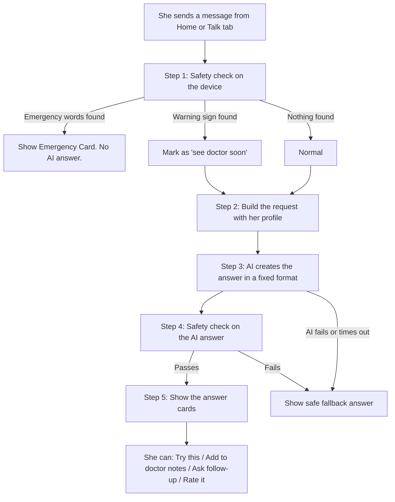
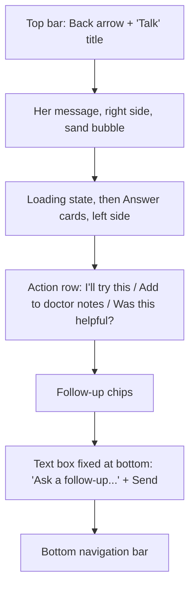

# LaterUp: Page 3, Understanding (The Hero Screen)

**Product:** LaterUp, a private, personalized menopause and midlife wellness companion, built India-first
**Page:** 3 of 5
**Document type:** Page requirements brief (user story format)
**Who this is for:** Anyone building this page: a developer, a designer, or an AI coding agent
**Depends on:** Page 1 (her profile), Page 2 (her typed message or tapped question)
**Feeds into:** Page 2 ("What you're trying" card), Page 4 (Patterns), Page 5 (Doctor Prep)

---

## 1. The page in one sentence

She tells LaterUp what she is feeling in her own words, and within seconds gets one warm, honest, personalized answer: what is likely happening, why, one small thing she can try that fits her life, and when it is worth seeing a doctor.

---

## 2. Why this page matters

**This is the wow moment of the whole app.** Every other page exists to support this one.

The feeling we want is a kind of surprise: she expects an app, and instead she gets understanding. She types something raw like *"I cried for no reason today and I can't sleep. Is something wrong with me?"* and the reply feels like it came from a wise, caring friend who knows about menopause and knows *her*.

**Why this beats other apps:**

| Other menopause apps | LaterUp |
|---|---|
| Make her pick a symptom from a list | She says it in her own words |
| Give her an article to read | Give her one short, clear answer |
| Same advice for everyone | Personalized to her age, stage, food and family life |
| Western examples (salmon, gym, therapy apps) | Indian examples (ragi, curd, dal, a walk after dinner, talking to family) |

**Why this beats a free AI chatbot:**

| Free chatbot | LaterUp |
|---|---|
| Knows nothing about her; she re-explains every time | Already knows her age, stage, symptoms, diet and life |
| Long, hedged, generic answers | Short, structured, warm answer every time |
| No safety layer built for menopause | Checks for warning signs before answering |
| Answer disappears into chat history | She can "try this" and LaterUp follows up; she can save it for her doctor |

**The one rule for this page:** if the answer feels generic or robotic, the wow is gone. The quality and warmth of the answer is everything.

---

## 3. User stories

### Story 1: Being heard in my own words

> As a woman who is worried, I want to describe what I'm feeling in my own words, so that I don't have to translate my experience into medical terms.

**Done when:**
- She can type anything, in any style, including Hinglish (for example, "bahut garmi lagti hai raat ko")
- The app never asks her to pick a category first
- Her message appears on screen as she sent it

### Story 2: A clear, warm answer

> As a woman who is tired and anxious, I want one short, clear answer, so that I understand what's happening without reading a long article.

**Done when:**
- The answer always has the same 4 simple parts (see Section 6)
- The whole answer can be read in under 1 minute
- No medical jargon, or if a term is needed, it is explained in brackets

### Story 3: An answer that knows me

> As a woman who already shared about myself, I want the answer to fit my life, so that it feels made for me.

**Done when:**
- The answer uses her stage, age group, symptoms, diet and life context from Page 1
- Food suggestions match her diet (no eggs for a vegetarian, no onion or garlic for Jain)
- Suggestions fit a busy Indian woman's day (short, practical, low cost)

### Story 4: Knowing when to see a doctor

> As a woman who isn't sure if this is serious, I want to know clearly when I should see a doctor, so that I don't ignore something important or panic over something normal.

**Done when:**
- Every answer ends with a "Talk to a doctor if..." section
- If her message contains a warning sign, the doctor advice appears **first**, not last
- If her message sounds like an emergency, the app shows emergency help **instead of** a normal answer

### Story 5: Trying something small

> As a woman who wants to feel better, I want to pick one small thing to try, so that I can see if it helps me.

**Done when:**
- The "small thing to try" has an `I'll try this` button
- Tapping it adds a card to Home (Page 2) that asks "Did it help?"

### Story 6: Saving it for my doctor

> As a woman who forgets things in the doctor's room, I want to save what I'm experiencing, so that I can show it to my doctor later.

**Done when:**
- Every answer has an `Add to my doctor notes` button
- Saved items appear on Page 5 (Doctor Prep)

### Story 7: Asking a follow-up

> As a woman with more questions, I want to ask a follow-up, so that I can understand better without starting over.

**Done when:**
- After each answer, 2 to 3 follow-up questions appear as tappable chips
- She can also type her own follow-up in the box at the bottom
- The app remembers the conversation so far

### Story 8: Telling the app if it helped

> As a woman using LaterUp, I want to say whether an answer was useful, so that it can get better for me.

**Done when:**
- Each answer has a small "Was this helpful?" with Yes and No
- Tapping No shows a short optional box: "What were you hoping for?"

---

## 4. How a message travels (the full flow)



---

## 5. Step 1: The safety check (happens BEFORE any AI)

**Why first:** if a woman describes something dangerous, she should not wait for an AI or read tips about breathing. She needs to be told clearly to get help now. This check uses simple word matching on her device, so it is instant and works even if the AI fails.

### Level 1: Emergency (stop and show help)

If her message includes words or phrases like these (in English or common Hinglish), **do not send it to the AI**. Show the Emergency Card instead.

| Type | Example words and phrases to match |
|---|---|
| Heart and breathing | chest pain, chest tightness, can't breathe, saans nahi aa rahi |
| Heavy bleeding | soaking a pad every hour, bleeding a lot, clots and dizzy |
| Fainting | fainted, passed out, behosh |
| Stroke signs | face drooping, can't speak properly, arm suddenly weak, worst headache of my life |
| Self-harm | want to die, end my life, kill myself, hurt myself, no reason to live, mar jaana chahti hoon |

**Emergency Card (for physical emergencies):**

> **Please get help right now.**
> What you're describing needs a doctor urgently. Please call **112** or go to the nearest hospital. If you can, ask someone at home to stay with you.
>
> `Call 112` (opens phone dialler)
> `I'm safe, go back`

**Emergency Card (for self-harm words):**

> **You matter, and you don't have to carry this alone.**
> It sounds like you're going through something very painful. Please talk to someone right now.
>
> **Tele-MANAS** (free, 24x7, government mental health helpline): **14416**
> **Emergency:** **112**
>
> If you can, tell someone you trust at home how you're feeling.
>
> `Call 14416` `Call 112`
> `I'm safe, go back`

**Rules:**
- Calm design: clay rose border, cream background, no flashing red
- Never shame or lecture
- Tapping "I'm safe, go back" returns to Home and does **not** save the message anywhere
- Builder note: verify both numbers are current before submission

### Level 2: See a doctor soon (answer, but doctor advice goes first)

If her message matches one of these, the AI still answers, but the "Talk to a doctor" section moves to the **top** and is styled more clearly.

| Warning sign | Why it matters |
|---|---|
| Bleeding after her periods have stopped for a year or more (Page 1 stage = `postmenopause` + words like "bleeding", "spotting", "periods came back") | Bleeding after menopause should always be checked by a doctor |
| Bleeding between periods or after intimacy | Should be checked |
| A lump in the breast | Should be checked |
| Feeling low or hopeless most days for more than 2 weeks | Could be depression, which is very treatable |
| Very heavy periods, or periods lasting much longer than usual | Can cause anaemia (low iron), very common in Indian women |
| Age group "Under 40" with periods stopping | Early menopause should be discussed with a doctor |

**Why this level exists:** these are common, important, and often ignored by Indian women who feel they are "making a fuss." LaterUp's job is to gently but clearly say: this one is worth a visit.

---

## 6. The answer: exactly what she sees

Every answer has the **same 4 parts, in the same order**, shown as soft cards stacked top to bottom. Consistency builds trust: she always knows where to look.

### The 4 parts

| # | Card title | What it does | Length |
|---|---|---|---|
| 1 | *(no title, just text)* | **I hear you:** one line that shows the app understood her, in warm words | 1 sentence |
| 2 | **What's likely happening** | Explains what she is experiencing and the simple "why" (usually hormones), and whether it is common | 2 to 4 short sentences |
| 3 | **One small thing to try** | One practical action that fits her life, diet and time, with an `I'll try this` button. A small `More ideas` link reveals 2 more | 1 to 2 sentences each |
| 4 | **Talk to a doctor if** | 2 to 3 clear signs that mean she should see a doctor | Short bullet list |

Then, under the cards:
- **Action buttons:** `Add to my doctor notes` and "Was this helpful?" `Yes` `No`
- **Follow-up chips:** 2 to 3 suggested next questions
- **Small note:** *LaterUp is a wellness guide, not medical advice.*

### A full example

**Her profile (from Page 1):** Meena, 45 to 49, irregular periods (`perimenopause`), top symptoms: poor sleep and mood swings, vegetarian, joint family, cares for in-laws, not comfortable talking to a doctor.

**Her message:**
> I haven't slept properly in three nights and I snapped at my daughter today. Is something wrong with me?

**LaterUp's answer:**

> Three bad nights and feeling short-tempered is exhausting, Meena, and no, nothing is "wrong" with you as a person.
>
> **What's likely happening**
> In midlife, hormones like oestrogen and progesterone often go up and down unevenly. They help with sleep and with keeping mood steady, so when they shift, many women sleep badly and feel more irritable, and poor sleep can make irritability worse. This may be part of what you're feeling. It's very common, and many women find small changes and the right support help.
>
> **One small thing to try**
> Keep your last cup of chai before 4 pm, and spend the last 10 minutes before bed away from your phone and the TV, with slow breathing (breathe in for 4 counts, out for 6).
> `I'll try this`
> `More ideas`
> - Keep the bedroom cool and wear light cotton at night.
> - A short walk after dinner, even 10 minutes on the terrace or around the building.
>
> **Talk to a doctor if**
> - Poor sleep continues most nights for more than 3 to 4 weeks
> - You feel low, hopeless or teary most days for 2 weeks or more
> - Someone notices you snoring loudly or stopping breathing in your sleep
>
> When you're ready, LaterUp can help you prepare what to say to your doctor.
>
> `Add to my doctor notes` · Was this helpful? `Yes` `No`
>
> **You could also ask:**
> `How do I explain this to my family?` `Is it normal to feel angry so often?` `What helps with night sweats?`

**Why this works:**
- It uses her name once, not repeatedly
- It answers her real fear ("is something wrong with me?") in the first line
- It explains the hormonal "why" in one breath, without jargon
- The tip mentions chai, not coffee; a terrace walk, not a gym
- The doctor section is honest and specific
- The last line gently addresses her discomfort with doctors (she said so on Page 1)
- The follow-up "How do I explain this to my family?" fits her joint-family life

---

## 7. Step 2 and 3: How the AI creates the answer

### What gets sent to the AI

Only what is needed. **Her name is never sent.** The app adds her name into the answer on the device.

```json
{
  "message": "I haven't slept properly in three nights and I snapped at my daughter today. Is something wrong with me?",
  "profile": {
    "ageGroup": "45-49",
    "stage": "perimenopause",
    "topSymptoms": ["poor_sleep", "mood_swings"],
    "diet": "vegetarian",
    "lifeContext": ["joint_family", "cares_for_elders"],
    "doctorStatus": "not_comfortable"
  },
  "seeDoctorSoon": false,
  "recentCheckins": ["tough", "tough", "okay"],
  "conversationSoFar": []
}
```

### The instructions given to the AI (system prompt)

Use this text as the AI's instructions. It defines LaterUp's voice and safety rules.

```text
You are LaterUp, a warm, knowledgeable companion for Indian women going through
perimenopause, menopause and midlife. You speak like a caring, well-informed
friend who has been through this, not like a doctor or a textbook.

YOUR JOB
Help her understand what she is experiencing, suggest one small practical thing
to try, and tell her clearly when to see a doctor.

HOW YOU SPEAK
- Warm, calm, simple English. Short sentences. No jargon. If a medical word is
  needed, explain it in brackets.
- If she writes in Hinglish, you may include a few familiar Hindi words, but
  keep the answer mainly in simple English.
- Start by acknowledging how she feels, and answer her real worry directly.
- Use "many women", "it's common", "this may be". Never say "you have" a
  condition.
- Do not use the placeholder {name}. The app adds her name.

PERSONALIZE USING HER PROFILE
- Stage, age group and top symptoms: connect the answer to her stage.
- Diet: food suggestions must match it. Vegetarian: no meat, fish or eggs.
  Eggetarian: eggs allowed, no meat or fish. Jain: no meat, fish, eggs, onion,
  garlic or root vegetables. Vegan: no dairy, meat, fish or eggs.
- Prefer familiar Indian foods and habits: ragi, til, curd, dal, chana, methi,
  seasonal fruits, a walk after dinner, pranayama-style slow breathing, chai
  timing, cotton clothing.
- Life context: if she lives in a joint family or cares for elders, keep
  suggestions short (5 to 10 minutes), low cost and doable at home.
- If doctorStatus is "not_comfortable", be extra gentle about seeing a doctor
  and mention that LaterUp can help her prepare.

SAFETY RULES (NEVER BREAK)
- Never diagnose. Never name a specific medicine, supplement or dose.
- Never tell her she is perimenopausal, menopausal or postmenopausal, and
  never say a symptom IS caused by menopause. Say hormonal changes common in
  midlife "can play a part" or "may be linked".
- Never promise outcomes. Say "try this and notice how you feel", never
  "this will improve your sleep".
- You may say that treatments like hormone therapy exist and are worth
  discussing with a doctor, without recommending them.
- Never claim any food, herb or practice "cures" or "treats" anything.
- Never tell her to stop or change any medicine she is taking.
- If seeDoctorSoon is true, the doctor section must be clear, specific and
  calm, and must say to book a visit soon.
- If you are unsure, say so honestly and suggest a doctor.
- Stay within menopause, midlife and general wellbeing. If asked about
  something unrelated, kindly say you can only help with midlife health.

OUTPUT
Respond ONLY with valid JSON in exactly this format, with no extra text:
{
  "hearYou": "one warm sentence",
  "whatsHappening": "2 to 4 short sentences",
  "tryThis": {
    "main": "one practical action, 1 to 2 sentences",
    "more": ["second idea", "third idea"]
  },
  "seeDoctorIf": ["sign 1", "sign 2", "sign 3"],
  "closingLine": "optional single gentle sentence, or empty string",
  "followUps": ["question 1", "question 2", "question 3"],
  "symptomTags": ["poor_sleep", "mood_swings"]
}
```

**Why JSON:** the app can place each part in its own card reliably, and the `symptomTags` let Patterns and Doctor Prep know what the conversation was about.

### Technical notes for the builder

- Use any good AI model through its API (for example, Claude)
- **Never put the API key inside the web page.** Call the AI through a small server function (for example, a serverless function on Vercel or Netlify) that holds the key
- The server function should not store or log her message
- Target: answer appears within 5 to 8 seconds
- Keep the last 6 messages of the conversation as context for follow-ups

---

## 8. Step 4: Checking the AI's answer

Before showing the answer, check it on the device:

| Check | If it fails |
|---|---|
| The JSON is valid and has all parts | Show the fallback answer |
| No medicine names or doses (simple word list: mg, tablet, dose, and common medicine names) | Show the fallback answer |
| No "you have [condition]" phrasing | Show the fallback answer |
| `seeDoctorIf` is not empty | Add the default doctor list (below) |

**Why:** AI is good but not perfect. These simple checks protect her and protect LaterUp's credibility.

---

## 9. The fallback answer (when the AI fails)

**Very important for the assignment:** the reviewers will test this app, possibly many times. If the AI is slow or fails, the hero moment must not break.

**Plan:**
1. **Pre-written answers for the 15 suggested questions** from Page 2 (12 symptom questions plus 3 general ones), written in the same 4-part format and saved inside the app. If the AI fails on one of these questions, show the pre-written answer.
2. **For any other message**, show this gentle fallback:

> I'm having trouble answering right now, and I don't want to give you a rushed answer.
>
> **Talk to a doctor if**
> - What you're feeling is severe, or getting worse
> - It's affecting your sleep, work or relationships for more than a few weeks
> - Anything feels very different from your usual
>
> `Try again`

**Default doctor list** (used if the AI leaves this section empty):
- It's severe or getting worse
- It's lasted more than a few weeks
- It's affecting your daily life

---

## 10. The screen layout



### Her message
- Right side, soft sand bubble, her exact words
- Small time stamp below in soft grey

### Loading state
- A gentle, slow pulsing dot or a soft rising-sun shape in terracotta
- Text that changes every 2 seconds:
  1. "Reading what you shared..."
  2. "Thinking about your stage..."
  3. "Putting it simply..."
- No spinning wheels, no "Generating AI response"

### The answer cards
- Left side, full width on phone
- "I hear you" line: plain text, slightly larger (20 px), no card
- Each of the 3 other parts: its own soft card (sand background, 16 px rounded corners)
- Card titles in terracotta, semi-bold
- **When `seeDoctorSoon` is true:** the "Talk to a doctor" card moves to the top, gets a clay rose left border, and its title becomes **"Please see a doctor soon"**
- Cards appear one after another (gentle fade-in, 150 ms apart), not all at once

### The text box at the bottom
- Fixed at the bottom, above the navigation bar
- Placeholder: "Ask a follow-up, or tell me more..."
- Send button: deep teal circle with an arrow
- Every new message goes through the same safety check (Section 5)

---

## 11. The buttons, in detail

### `I'll try this`
- Adds the "main" suggestion to `tryingNow` (see data, Section 13)
- Button changes to: "✓ Added. We'll ask how it's going." (teal text)
- Also works on each idea under `More ideas`
- Maximum of 5 active "trying" items. If she tries a sixth, show: "You're already trying 5 things. Want to stop one first?" with a link to Patterns

### `Add to my doctor notes`
- Saves: date, her message, the `symptomTags`, and the "What's likely happening" summary
- Button changes to: "✓ Saved for your doctor"
- These appear on Page 5

### Was this helpful? `Yes` `No`
- `Yes`: shows "Thank you" and fades
- `No`: shows a small optional text box: "What were you hoping for?" with `Send` and `Skip`
- Saved on the device only (in a real version, this would help improve answers, with her permission)

### Follow-up chips
- Tapping one sends it as her next message
- They come from the AI's `followUps` list

---

## 12. Conversations

- The **Talk** tab always opens a **new**, empty conversation with the text box ready
- At the top of an empty Talk screen, show:
  > **What's on your mind?**
  > Say it in your own words.
  plus the same 3 suggested questions as Home
- Below that, a small `Recent` section listing her last 5 conversations by their first line (for example, "I haven't slept properly in three...") and date. Tapping one reopens it
- Each conversation has a small `Delete` option (three-dot menu)

---

## 13. What the page saves (for the builder)

Everything stays **only on her device**.

```json
{
  "conversations": [
    {
      "id": "conv_014",
      "startedAt": "2026-10-05T23:40:00",
      "messages": [
        { "from": "her", "text": "I haven't slept properly in three nights..." },
        { "from": "laterup", "answer": { "hearYou": "...", "whatsHappening": "...", "tryThis": {}, "seeDoctorIf": [], "followUps": [] } }
      ],
      "symptomTags": ["poor_sleep", "mood_swings"],
      "seeDoctorSoon": false,
      "helpful": true
    }
  ],
  "tryingNow": [
    {
      "id": "try_002",
      "action": "Last chai before 4 pm and 10 minutes of slow breathing before bed",
      "forSymptom": "poor_sleep",
      "startedDate": "2026-10-05",
      "active": true,
      "feedback": []
    }
  ],
  "doctorNotes": [
    {
      "date": "2026-10-05",
      "herWords": "I haven't slept properly in three nights and I snapped at my daughter today.",
      "symptomTags": ["poor_sleep", "mood_swings"],
      "summary": "Poor sleep and irritability, possibly linked to hormonal changes in perimenopause.",
      "seeDoctorSoon": false
    }
  ]
}
```

**Who uses what:**

| Data | Used by |
|---|---|
| `tryingNow` | Page 2 card, Page 4 "What's helping", Page 5 summary |
| `doctorNotes` | Page 5 |
| `symptomTags` across conversations | Page 4 (what she talks about most), Page 5 |
| `seeDoctorSoon` | Page 5 highlights these first |

---

## 14. Look and feel

### Colours

| Role | Colour | Hex | Use on this page |
|---|---|---|---|
| Background | Warm cream | `#FAF5EE` | Page |
| Surface | Soft sand | `#F1E7DA` | Her message bubble, answer cards |
| Accent | Terracotta | `#C2673F` | Card titles, loading shape |
| Action | Deep teal | `#1F5C5A` | Send button, "I'll try this", selected states |
| Gentle touch | Clay rose | `#D49A89` | "See a doctor soon" border, Emergency Card border |
| Main text | Warm charcoal | `#2E2A26` | All answer text |
| Soft text | Muted brown-grey | `#6B625A` | Time stamps, small notes |

### Fonts and sizes

- `DM Sans`, fallback `system-ui, sans-serif`
- "I hear you" line: 20 px
- Card titles: 17 px, semi-bold, terracotta
- Answer text: 18 px minimum, line height 1.6
- Small notes: 15 px minimum

### Tone checklist for every answer

| Always | Never |
|---|---|
| Answer her real worry first | Start with "Great question!" |
| "Many women..." | "You have..." |
| "This may help" | "This will cure" |
| Indian, everyday examples | Expensive products or Western-only foods |
| Short paragraphs | Walls of text |
| Specific doctor signs | "Consult a healthcare professional" alone, with no detail |

---

## 15. Privacy and safety rules (must follow)

1. Emergency safety check runs **on the device, before** any AI call
2. Emergency messages are **never sent** to the AI and **never saved**
3. Her **name is never sent** to the AI
4. The API key lives **only on a server function**, never in the page
5. The server function **does not store or log** her messages
6. All conversations, notes and "trying" items are saved **only on her device**
7. AI answers are **checked** for medicine names, doses and diagnosis phrasing before showing
8. Every answer shows: *LaterUp is a wellness guide, not medical advice.*
9. She can **delete any conversation**, and "Delete my data" in Settings clears all of them

**Why this matters for the submission:** Mosaic is a real health company. A student app that talks about health with no safety thinking is a red flag. A student app with a clear, layered safety design is a strong signal of maturity. Mention this in the submission note.

---

## 16. Accessibility

- Body text 18 px or larger, strong contrast
- Answer cards are read by screen readers in order: "I hear you" line, then each card title and text
- All buttons reachable by keyboard
- The fade-in effect turns off if her phone has "reduce motion" switched on
- Phone first, then laptop

---

## 17. Special situations

| Situation | What should happen |
|---|---|
| Very short message ("hi", "help") | AI replies warmly and asks one gentle question: "I'm here. What's been on your mind lately?" (in `hearYou`, other cards can be skipped) |
| Message unrelated to health ("write my essay") | Kind reply: "I can only help with midlife and menopause health. Is there something you're feeling that I can help with?" |
| Message in Hindi or Hinglish | Answer in simple English with a few familiar Hindi words where natural |
| She asks about a medicine or HRT dose | Explain gently that this is a decision for her doctor; offer to add the question to her doctor notes |
| She asks "Do I have cancer?" or similar fear | Acknowledge the fear, do not diagnose, explain which signs mean she should get checked, and move the doctor card to the top |
| No internet | Show: "You're offline. Your past conversations are still here." Pre-written answers for suggested questions still work |
| AI takes more than 15 seconds | Show the fallback answer with `Try again` |
| She leaves mid-answer | Conversation is saved; she can reopen it from Recent |
| She already has 5 active "trying" items | Show the limit message (Section 11) |

---

## 18. Not included in this version (on purpose)

- Voice input (great future feature; mention in the submission note)
- Answers fully in Hindi or other Indian languages
- Photos or uploads (for example, reports)
- Connecting to a real doctor or teleconsult
- Sharing answers with family

---

## 19. Final checklist before calling Page 3 done

- [ ] She can type anything in her own words, including Hinglish
- [ ] Emergency safety check runs before the AI and shows the correct Emergency Card
- [ ] "See a doctor soon" warnings move the doctor card to the top
- [ ] Every answer has the same 4 parts in the same order
- [ ] Answers are personalized to stage, age, symptoms, diet and life context
- [ ] Food suggestions always match her diet
- [ ] No medicine names, doses or diagnosis phrases ever appear
- [ ] `I'll try this` adds a card to Home
- [ ] `Add to my doctor notes` saves to Page 5
- [ ] "Was this helpful?" works
- [ ] Follow-up chips and typed follow-ups work, with conversation memory
- [ ] Pre-written answers exist for all 15 suggested questions
- [ ] Fallback answer shows if the AI fails or is slow
- [ ] API key is on a server function, not in the page
- [ ] Her name is never sent to the AI
- [ ] Everything saved only on her device
- [ ] Gentle loading state, no spinner
- [ ] Works smoothly on a phone

---

**Next:** Page 4, Patterns.
