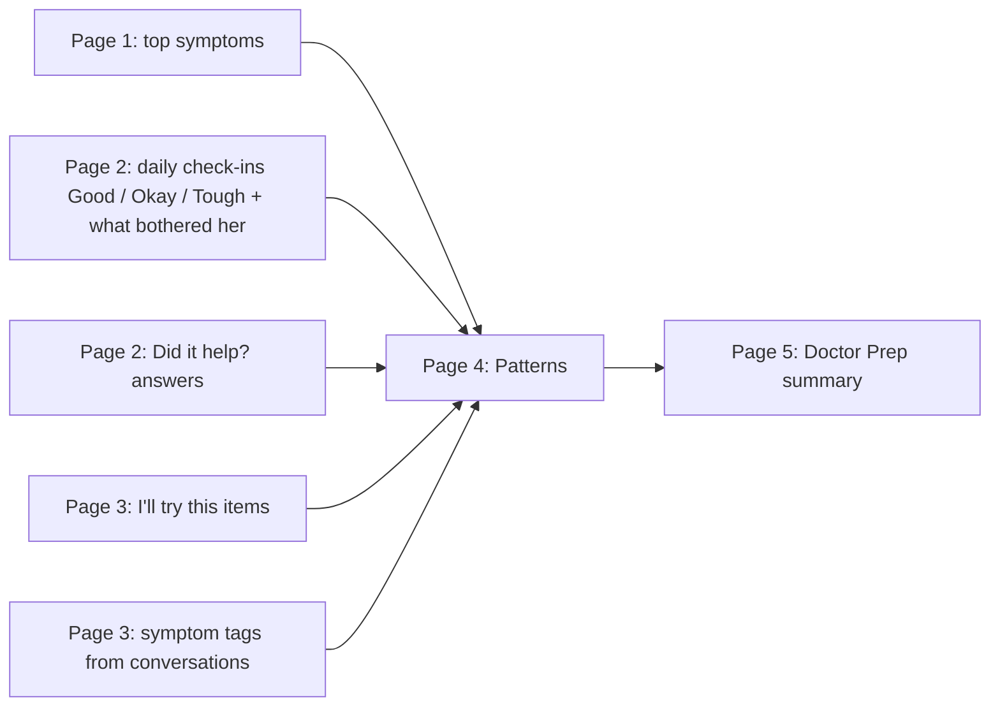
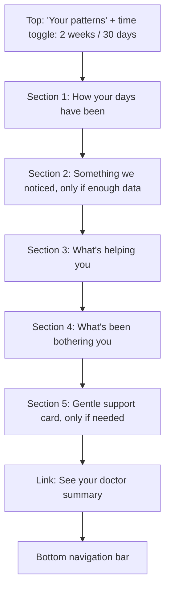

# LaterUp: Page 4, Patterns

**Product:** LaterUp, a private, personalized menopause and midlife wellness companion, built India-first
**Page:** 4 of 5
**Document type:** Page requirements brief (user story format)
**Who this is for:** Anyone building this page: a developer, a designer, or an AI coding agent
**Depends on:** Page 1 (profile), Page 2 (daily check-ins, "Did it help?" answers), Page 3 (conversations, "I'll try this" items)
**Feeds into:** Page 5 (Doctor Prep)

---

## 1. The page in one sentence

Patterns shows her, in simple words and gentle visuals, how her days have been, what has been bothering her most, and, most importantly, **what is actually helping her**.

---

## 2. Why this page matters

Most menopause apps have a patterns page full of charts and numbers. They show symptoms. LaterUp shows something more useful: **what works for her**.

This page delivers the third pillar of LaterUp: *notice what actually works for you*. It turns all those tiny one-tap check-ins and "Did it help?" answers into a clear picture she could never see on her own.

**The feeling we want:** "Oh. So that's why." A small moment of her own life explaining itself to her.

**The rule for this page:** light, not heavy. No complicated graphs. If her mother could not understand a section at a glance, it is too complicated.

**Why it matters for the business:** this page is the reason to keep checking in. The more she taps, the smarter this page gets. That is the gentle daily habit we discussed, earned through usefulness, not streaks.

---

## 3. User stories

### Story 1: Seeing how my days have been

> As a woman going through ups and downs, I want to see my good and tough days at a glance, so that I can see if things are getting better or worse.

**Done when:**
- A simple row of coloured dots shows the last 14 days (Good, Okay, Tough, or not checked in)
- One plain sentence sums it up, for example: "You had 4 tough days in the last 2 weeks, down from 7 the 2 weeks before."

### Story 2: Knowing what bothers me most

> As a woman with many symptoms, I want to know which ones come up most, so that I know what to focus on.

**Done when:**
- Her top symptoms are listed with how many days each came up
- Written in words, for example: "Poor sleep: 6 of the last 14 days"

### Story 3: Knowing what actually helps me

> As a woman trying small changes, I want to see which ones are helping, so that I keep the good ones and drop the rest.

**Done when:**
- Each thing she is trying shows a simple result label: "Seems to help," "Mixed," "Not helping yet," or "Too early to tell"
- She can choose to keep trying or stop each one

### Story 4: Getting a gentle insight

> As a woman who can't see connections in my own life, I want the app to point out a pattern, so that I understand myself better.

**Done when:**
- When there is enough data, one "Something we noticed" card appears
- The insight is written carefully, as a pattern, never as a medical cause

### Story 5: Not feeling judged by empty data

> As a new user, I want to understand why this page is mostly empty, so that I don't feel I did something wrong.

**Done when:**
- New users see a kind empty state that explains how the page fills up
- A clearly labelled example lets her (and the reviewers) see what it will look like

### Story 6: Being looked after on hard stretches

> As a woman having many tough days in a row, I want the app to notice gently, so that I get nudged toward support.

**Done when:**
- If most recent days were tough, a gentle support card appears (see Section 8)

---

## 4. Where the data comes from



**Important:** this page does **not** use AI. All results are calculated with simple, clear rules on her device. That makes them reliable, instant and private.

---

## 5. The layout, top to bottom



**Why "What's helping you" comes before "What's been bothering you":** LaterUp leads with solutions, not problems. This order is a deliberate design choice that reflects the whole product idea.

---

## 6. Section by section: exactly what she sees

### Top of the page

**Title:**
> Your patterns

**Sub line:**
> Built from your check-ins. Only you can see this.

**Time toggle** (two small rounded buttons): `Last 2 weeks` (default) and `Last 30 days`

---

### Section 1: How your days have been

**Heading:**
> How your days have been

**The dot row:**
- One dot per day, oldest on the left, today on the right
- 14 dots for 2 weeks; for 30 days, show 2 or 3 rows of 10 to 15 dots
- Small day letters under each dot (M, T, W...) for the 2-week view only

| Check-in | Dot style |
|---|---|
| Good | Filled deep teal `#1F5C5A` |
| Okay | Filled soft sand with teal outline |
| Tough | Filled terracotta `#C2673F` |
| No check-in | Small empty grey circle |

Tapping a dot shows a small label: "Tue, 30 Sep: Tough. Bothered by: poor sleep, mood swings."

**Summary sentence** under the dots (pick the first that applies):

| Situation | Summary sentence |
|---|---|
| Fewer than 4 check-ins in the period | "A few more check-ins and you'll start to see your patterns." |
| Fewer tough days than the period before | "You had [X] tough days, fewer than the [Y] before. That's real progress." |
| More tough days than the period before | "You've had [X] tough days lately, more than before. Let's look at what might help." |
| About the same | "You had [X] good days and [Y] tough days in this period." |

**Why dots, not a line chart:** dots are easier to read for everyone, feel softer, and do not look like a medical report.

---

### Section 2: Something we noticed (the "aha" moment)

**Only shown when she has at least 7 check-ins in the selected period.** Shows **one** insight at a time (the strongest one). A small `See another` link shows the next one if there is more than one.

**Card style:** soft sand card with a small terracotta sparkle or sun icon.

**Heading:**
> Something we noticed

**Example:**
> On days you mentioned poor sleep, 5 out of 6 were tough days. On other days, only 1 out of 8 was tough.
> Sleep seems to affect how your whole day feels.
>
> `Talk about this` (opens Page 3 with "Why does poor sleep affect my mood so much?")

**Small note under every insight, always:**
> This is a pattern from your check-ins, not a medical finding.

#### The insight rules (for the builder)

Check these rules in order. Show the strongest one that qualifies.

| # | Insight type | Rule (all must be true) | Example wording |
|---|---|---|---|
| 1 | **Something is helping** | A "trying" item has 4+ answers, and 75% or more are "Yes" or "A little" | "Keeping your chai before 4 pm has helped on 4 of the 5 days you tried it. Worth keeping." |
| 2 | **One symptom shapes the day** | A symptom was tagged on at least 3 days; on those days, tough days are at least 30 percentage points higher than on days without it; at least 3 days without it | "On days you mentioned poor sleep, 5 of 6 were tough. On other days, only 1 of 8. Sleep seems to affect how your whole day feels." |
| 3 | **Days are getting better** | At least 3 fewer tough days than the previous period | "Your tough days went from 7 to 4. Whatever you're doing, it's working." |
| 4 | **Most common symptom** | Any symptom tagged on 5+ days | "Hot flashes came up most often, on 6 of the last 14 days. Want to learn what helps?" |

**Wording rules for insights:**
- Always use her actual numbers ("5 of 6"), never percentages. Numbers like "5 of 6" are easier to understand.
- Use "seems to," "came up," "on days when." Never "causes," "because of," or "proves."
- Always end with something hopeful or a next step.

**Why this card matters:** this is the second wow of the app. The first is feeling understood on Page 3. This one is understanding *herself*.

---

### Section 3: What's helping you

**Heading:**
> What's helping you

**One card per "trying" item** (active ones first, then stopped ones under a small `Things you tried before` link).

**Card layout:**

> **Last chai before 4 pm + 10 minutes of slow breathing**
> For: Poor sleep · Trying for 6 days
>
> ●●●●○ Helped on 4 of 5 days you answered
> **Seems to help** ✓
>
> `Keep trying` `Stop`

**The little dots:** one per answer, teal for "Yes," half-filled for "A little," empty for "Not really."

**Result labels:**

| Rule | Label | Label colour |
|---|---|---|
| Fewer than 3 answers | Too early to tell | Soft grey |
| 75% or more "Yes" or "A little" | Seems to help ✓ | Deep teal |
| 40% to 74% "Yes" or "A little" | Mixed | Terracotta |
| Under 40% "Yes" or "A little" | Not helping yet | Muted brown-grey |

**For "Not helping yet," add one kind line:**
> That's okay. Not everything works for everyone. Want to find something else to try?
> `Find another idea` (opens Page 3 with "What else can I try for [symptom]?")

**Buttons:**
- `Keep trying`: nothing changes, just a small "Great" confirmation
- `Stop`: moves the item to "Things you tried before" and removes its card from Home. Its history is kept for Page 5.

**If she is not trying anything yet:**
> You're not trying anything yet. When LaterUp suggests something on the Talk screen, tap **I'll try this** and we'll track whether it helps you.
> `Go to Talk`

**Why this section matters:** this is LaterUp's clearest difference from every other menopause app. Others track problems. LaterUp tracks solutions that work for *her*.

---

### Section 4: What's been bothering you

**Heading:**
> What's been bothering you

**A simple list**, most frequent first, top 5 only:

> Poor sleep ▬▬▬▬▬▬ 6 days
> Mood swings ▬▬▬▬ 4 days
> Hot flashes ▬▬ 2 days

- Each row: symptom name, a soft terracotta bar, and "[X] days"
- The bar length is relative to the most frequent symptom
- Tapping a row opens Page 3 with "What helps with [symptom]?"

**How to count a "day" for a symptom:** a symptom counts once per day if it was tapped in that day's check-in follow-up (Page 2) **or** tagged in a conversation that day (Page 3).

**If no symptoms were logged:**
> When you check in on Home, you can tap what's bothering you. It'll show up here.

---

### Section 5: Gentle support card (only when needed)

**Show when:** 8 or more of the last 14 days were "Tough," **or** 5 or more tough days in a row.

**Card style:** clay rose left border, cream background, calm.

> **It's been a hard stretch.**
> You've had many tough days lately. That's a lot to carry, and you don't have to carry it alone. It may really help to talk to a doctor, or to someone you trust at home.
>
> `Prepare for a doctor visit` (opens Page 5)
> `Talk about it` (opens Page 3)
>
> If you ever feel you can't cope, you can call **Tele-MANAS** for free at **14416**, any time.

**Rules:**
- Shown at most once a day; she can close it with a small "×"
- Never alarming, never shown as a pop-up

**Why this exists:** low mood and anxiety in midlife are common and often missed, especially when women put their families first. A gentle nudge here could genuinely matter.

---

### Bottom link

> `See your doctor summary →` (opens Page 5)

**Wellness note** (small, above the navigation bar):
> LaterUp is a wellness guide, not medical advice.

---

## 7. The empty state and the example view

### When she is new (fewer than 4 check-ins ever)

Instead of empty charts, show:

> **Your patterns will grow here**
> Every time you check in on Home, LaterUp learns a little more about your days. After about a week, you'll start to see what's affecting you, and what's helping.
>
> ●●●○○○○ 3 of 7 check-ins to your first pattern
>
> `Check in now` (opens Home, scrolled to check-in)
> `See an example`

### The example view (very important for the assignment)

**Why:** the reviewers at Mosaic will try the app once. They will not check in for two weeks. Without an example, they will see an empty page and miss the second wow moment.

**How it works:**
- `See an example` fills this page with **sample data** (14 days of check-ins, 2 "trying" items, a clear insight)
- A clear banner sits at the top the whole time:
  > 👀 **This is an example.** Your real patterns will appear as you check in. `Exit example`
- Sample data is **never mixed** with her real data and **never** appears on Page 5
- Also show a small `See an example` link at the bottom of the page for users who do have some data

**Sample data to use** (so the example tells a clear story):
- 14 days: early days mostly tough, later days mostly good or okay
- Poor sleep tagged on 6 days, 5 of them tough
- Trying item 1: "Last chai before 4 pm + 10 minutes of slow breathing," 5 answers, 4 helpful → "Seems to help"
- Trying item 2: "A 10-minute walk after dinner," 2 answers → "Too early to tell"
- Insight shown: the sleep and mood insight from Section 6

---

## 8. Look and feel

### Colours

| Role | Colour | Hex | Use on this page |
|---|---|---|---|
| Background | Warm cream | `#FAF5EE` | Page |
| Surface | Soft sand | `#F1E7DA` | Cards |
| Accent | Terracotta | `#C2673F` | Tough-day dots, symptom bars, "Mixed" label, insight icon |
| Action | Deep teal | `#1F5C5A` | Good-day dots, "Seems to help" label, buttons, active toggle |
| Gentle touch | Clay rose | `#D49A89` | Support card border |
| Main text | Warm charcoal | `#2E2A26` | Text |
| Soft text | Muted brown-grey | `#6B625A` | Notes, "No check-in" dots, "Not helping yet" |

**Colour rule:** never use red or green for good and bad. Teal and terracotta are calmer, and they work for people with red-green colour blindness.

### Fonts and sizes

- `DM Sans`, fallback `system-ui, sans-serif`
- Page title: 28 px, semi-bold
- Section headings: 20 px, semi-bold
- Body and summary sentences: 18 px minimum
- Small labels and notes: 15 px minimum

### Visual rules

- No line charts, pie charts, percentages or scores
- Only dots and simple bars
- Every visual has a plain sentence next to it saying what it means
- Lots of space between sections

---

## 9. The calculations (for the builder)

All done on the device from saved data. No AI, no server.

| What | How to calculate |
|---|---|
| Tough days in period | Count check-ins with `feeling = "tough"` in the selected date range |
| Previous period | The same number of days immediately before the selected range |
| Symptom day count | For each symptom, count unique dates where it appears in check-in `bothering` or in a conversation's `symptomTags` |
| "Trying" result | Count feedback answers; helpful = "yes" + "a_little"; helpful share = helpful ÷ total answers |
| Symptom insight | Days with symptom: share of tough days. Days without: share of tough days. Show if the difference is 30 points or more, with at least 3 days in each group |
| Support card | Tough check-ins in last 14 days ≥ 8, or a run of 5+ tough days in a row |

**Example data shape this page reads** (already created by Pages 1 to 3):

```json
{
  "profile": { "topSymptoms": ["poor_sleep", "mood_swings"] },
  "checkins": [
    { "date": "2026-10-04", "feeling": "tough", "bothering": ["poor_sleep"] }
  ],
  "tryingNow": [
    {
      "id": "try_002",
      "action": "Last chai before 4 pm + 10 minutes of slow breathing",
      "forSymptom": "poor_sleep",
      "startedDate": "2026-09-29",
      "active": true,
      "feedback": [
        { "date": "2026-09-30", "result": "yes" },
        { "date": "2026-10-01", "result": "a_little" }
      ]
    }
  ],
  "conversations": [
    { "startedAt": "2026-10-05T23:40:00", "symptomTags": ["poor_sleep", "mood_swings"] }
  ]
}
```

**New data this page saves:**

```json
{
  "patternsSettings": {
    "range": "14",
    "supportCardDismissedOn": "2026-10-05",
    "exampleMode": false
  }
}
```

---

## 10. Privacy and safety rules (must follow)

1. All calculations happen **on her device**; nothing is sent anywhere
2. Insights are always labelled **"a pattern from your check-ins, not a medical finding"**
3. No wording that suggests a cause or diagnosis
4. Example data is **clearly labelled** and **never** mixed with real data or sent to Page 5
5. Support card is **calm**, never alarming, and includes a helpline
6. "Delete my data" in Settings clears everything on this page too

---

## 11. Accessibility

- Every dot and bar has a text alternative, for example: "Tuesday 30 September, tough day"
- Summary sentences mean screen-reader users get the full picture without seeing visuals
- Teal and terracotta chosen to be readable with colour blindness, plus shapes (filled, outlined, empty) so colour is never the only signal
- Body text 18 px or larger
- All buttons reachable by keyboard
- Phone first, then laptop

---

## 12. Special situations

| Situation | What should happen |
|---|---|
| Brand new user | Empty state with progress and `See an example` |
| Has check-ins but never tapped symptoms | Sections 1 and 3 work; Section 4 shows its gentle empty message |
| Missed many days | Empty grey dots; no guilt messages like "You missed 5 days" |
| Only good days | No support card; summary celebrates gently: "You've had a good stretch. Lovely to see." |
| Switches to 30 days with only 10 days of data | Show what exists; previous-period comparison is hidden if there's no earlier data |
| Stops a "trying" item | Moves to "Things you tried before," keeps its result label |
| Exits example mode | Page returns to her real data instantly |
| Deletes her data | Page returns to the new-user empty state |

---

## 13. Not included in this version (on purpose)

- Cycle or period calendar
- Detailed charts or downloadable data
- AI-generated insights (rule-based is more reliable and private for now)
- Connecting to wearables or sleep trackers
- Comparing with other women

These can be listed as future ideas in the submission note.

---

## 14. Final checklist before calling Page 4 done

- [ ] "Your patterns" title with 2-week / 30-day toggle
- [ ] Dot row for days, with a plain summary sentence
- [ ] "Something we noticed" insight appears only with 7+ check-ins
- [ ] Insight rules follow Section 6 and always show the "not a medical finding" note
- [ ] "What's helping you" cards with result labels and Keep / Stop
- [ ] "Not helping yet" shows a kind line and `Find another idea`
- [ ] "What's been bothering you" list, top 5, with day counts
- [ ] Gentle support card appears only in hard stretches, with helpline
- [ ] Empty state with progress for new users
- [ ] `See an example` mode with a clear banner, never mixed with real data
- [ ] No line charts, percentages, streaks or guilt messages
- [ ] No red/green; teal and terracotta with shape differences
- [ ] All calculations on the device
- [ ] Works smoothly on a phone

---

**Next:** Page 5, Doctor Prep.
