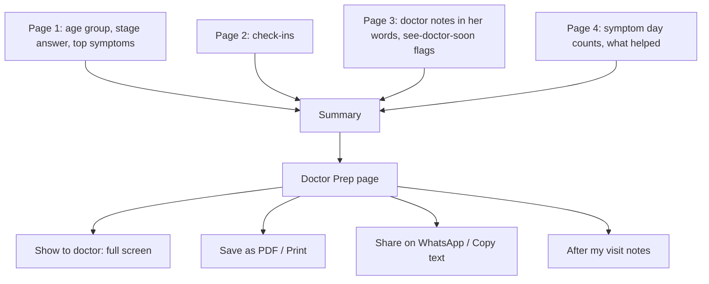
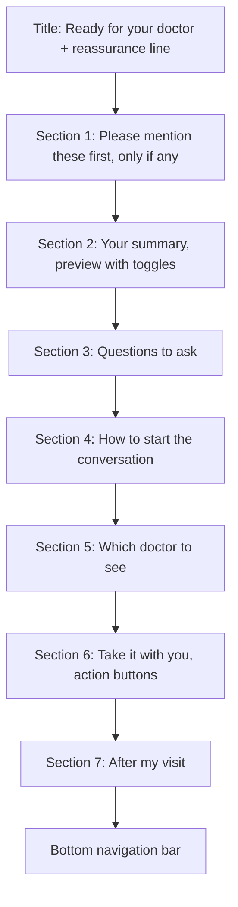
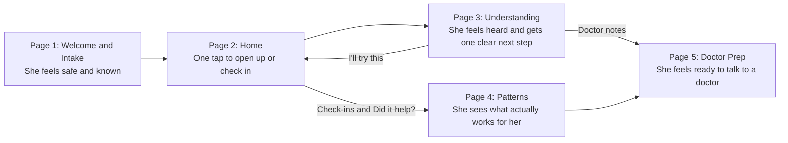

# LaterUp: Page 5, Doctor Prep

**Product:** LaterUp, a private, personalized menopause and midlife wellness companion, built India-first
**Page:** 5 of 5
**Document type:** Page requirements brief (user story format)
**Who this is for:** Anyone building this page: a developer, a designer, or an AI coding agent
**Depends on:** Page 1 (profile), Page 2 (check-ins), Page 3 (doctor notes, conversations, "trying" items), Page 4 (patterns and results)

---

## 1. The page in one sentence

Doctor Prep turns everything she has shared with LaterUp into a clean, one-page summary and a short list of questions, so she can walk into a doctor's room feeling prepared, and say what she needs to say, even if it feels awkward.

---

## 2. Why this page matters

Many Indian women never talk to a doctor about menopause. The reasons are real:

- They feel embarrassed, especially about periods, mood or intimacy
- They feel they are "making a fuss" over something every woman goes through
- In a short appointment, they forget half of what they wanted to say
- They have mentioned it before and felt dismissed

This page solves all four. It gives her **the facts** (her own patterns, in her own words), **the questions** (so she doesn't forget), and **the words to begin** (so the first sentence is not so hard).

This delivers the fourth pillar of LaterUp: *feel prepared to talk to a healthcare professional*.

**Why it matters for the business:**
- It is **the most credible feature** in the app. It shows LaterUp works *with* doctors, not against them.
- It is a natural **premium feature** in the freemium model (see Section 13).
- It opens the door to future **partnerships with gynaecologists and clinics**, and to the **workplace (B2B) version**.

**Why it matters for the assignment:** Mosaic builds health brands that sit close to real medical care. A student app that ends with "go see a doctor, and here's exactly how" shows real understanding of responsibility and of people.

---

## 3. User stories

### Story 1: A summary I can show

> As a woman who forgets things in the doctor's room, I want a clear summary of what I've been going through, so that I can show it instead of trying to remember.

**Done when:**
- The summary is built automatically from her data
- It fits on one screen in "Show to doctor" mode, and on one A4 page when printed
- It uses plain language a doctor can read in under a minute

### Story 2: Important things first

> As a woman with a warning sign, I want the most important thing to be at the top, so that it doesn't get missed.

**Done when:**
- Any note marked "see a doctor soon" on Page 3 appears first, in a highlighted box

### Story 3: Questions to ask

> As a woman who doesn't know what to ask, I want a short list of good questions, so that I make the most of the appointment.

**Done when:**
- 4 to 6 suggested questions appear, based on her stage and symptoms
- She can tick which to include, remove any, and add her own

### Story 4: Help with the first sentence

> As a woman who feels awkward talking about this, I want a sentence I can say to start, so that I don't freeze.

**Done when:**
- A short "How to start the conversation" card gives one sentence in English and the same in Hindi
- The sentence uses her actual top symptoms and how long she has had them

### Story 5: Control over what's shared

> As a woman with private concerns, I want to choose what goes into my summary, so that I only share what I'm comfortable with.

**Done when:**
- Every section and every note has an include/exclude toggle
- Nothing leaves her phone unless **she** chooses to print, download or share it

### Story 6: Easy to take with me

> As a woman going to the doctor, I want to show, print or send my summary easily, so that it's with me at the appointment.

**Done when:**
- `Show to doctor` opens a clean, large-text full-screen view
- `Save as PDF / Print` works
- `Share on WhatsApp` and `Copy text` work, with a clear privacy reminder first

### Story 7: Remembering what the doctor said

> As a woman who just saw a doctor, I want to write down what they told me, so that I don't forget.

**Done when:**
- She can add short "After my visit" notes, saved on her device

---

## 4. How the page is built



**Important:** this page does **not** use AI. It assembles her own data using clear templates. That keeps it accurate, private and instant.

---

## 5. The layout, top to bottom



---

## 6. Section by section: exactly what she sees

### Top of the page

**Title:**
> Ready for your doctor

**Reassurance line** (changes with her Page 1 answer to "Have you spoken to a doctor?"):

| Her Page 1 answer | Line shown |
|---|---|
| Yes, I'm seeing a doctor | "Here's everything in one place for your next visit." |
| I've mentioned it, but didn't get much help | "You deserve to be heard. This summary helps you explain clearly what you're going through." |
| Not yet | "Talking to a doctor is a strong step. We've put everything together to make it easier." |
| I'm not comfortable talking about it | "It's okay to feel unsure. Doctors hear about this every day. You can simply show them this page." |
| Skipped | "Here's everything in one place for when you're ready." |

**Why:** the last line is the most important. "You can simply show them this page" removes the hardest part, saying it out loud.

---

### Section 1: Please mention these first (only shown if needed)

Shown only if any saved doctor note has `seeDoctorSoon: true` (from Page 3's warning-sign check).

**Box style:** clay rose left border, cream background, calm (not alarming red).

> **Please mention these first**
> 📅 3 Oct · "I had some spotting even though my periods stopped over a year ago."
>
> These are worth checking with your doctor soon.

**Rules:**
- Shows her own words exactly as she typed them
- Most recent first
- These also appear at the very top of the printed or shared summary
- She **cannot** hide this section entirely, but she can remove individual notes (with a gentle confirm: "Are you sure? This seemed important to mention.")

---

### Section 2: Your summary

A preview of exactly what the doctor will see. Each part has a small toggle (`Include` on/off) on the right.

**Card heading:**
> Your summary

**Small helper text:**
> Turn off anything you'd rather not share.

#### Part A: About me

> **About me**
> Age group: 45 to 49
> Periods: "My periods have become irregular"
> Main concerns: Poor sleep, mood swings

- "Periods" uses her **exact answer** from Page 1, not a medical label like "perimenopause." Doctors should hear it in her words and decide themselves.
- Diet and family details are **not** included by default (they are for LaterUp's suggestions, not the doctor). She can switch on "Diet" if she wants.

#### Part B: What I've been experiencing (last 30 days)

> **What I've been experiencing** (last 30 days)
> - Poor sleep: 12 days
> - Mood swings or irritability: 8 days
> - Hot flashes or night sweats: 4 days
>
> **How my days have been:** 9 good, 11 okay, 10 tough (30 check-ins)

- Top 5 symptoms by day count, using the same counting rule as Page 4
- If fewer than 7 check-ins, show this part as: "I've started tracking recently. Here's what I've noticed so far:" followed by her Page 1 top symptoms

#### Part C: In my own words

> **In my own words**
> 📅 5 Oct · "I haven't slept properly in three nights and I snapped at my daughter today."
> 📅 28 Sep · "I keep forgetting why I walked into a room."

- From `doctorNotes` saved on Page 3
- Maximum 5 shown; the most recent first
- Each note has its own small toggle and a `Remove` option
- **Why this part matters:** a doctor learns more from one real sentence than from a list of symptoms. Her own words also make her feel heard.

#### Part D: What I've tried

> **What I've tried**
> - Last chai before 4 pm + slow breathing (for poor sleep): seemed to help, 4 of 5 days
> - Walk after dinner (for mood): mixed, 2 of 4 days

- From `tryingNow` and stopped items, with Page 4's result labels
- Items with "Too early to tell" are listed as "just started"

#### Part E: Anything else for my doctor (optional, she types)

> **Anything else**
> *[Text box]* Placeholder: "For example: medicines or supplements you take, other health conditions, or family history."

- Free text, saved on her device only
- Not sent to any AI
- Limit: 500 characters

#### Footer on every summary (always included, cannot be turned off)

> Prepared by the patient using LaterUp, a wellness app, on 5 Oct 2026. Based on self-reported check-ins. This is not a medical record or diagnosis.

**Why this footer matters:** it is honest with the doctor about what this is, which makes the summary *more* trustworthy, not less.

---

### Section 3: Questions to ask

**Heading:**
> Questions you could ask

**Helper text:**
> Tick the ones you want to bring. You can add your own.

**Always suggested (general):**
1. Could what I'm feeling be related to perimenopause or menopause?
2. Are there any tests I should have, for example for thyroid, iron or vitamin D?
3. What are my options for managing these symptoms, and which might suit me?

**Added based on her top symptoms** (show up to 3 of these, matching her top symptoms):

| Her symptom | Suggested question |
|---|---|
| Poor sleep | What can I do about waking up at night? |
| Hot flashes or night sweats | What options are there for hot flashes, and what are the pros and cons of each? |
| Mood swings, anxiety or feeling low | Could my mood changes be related to hormones, and what support is available? |
| Forgetfulness or brain fog | Is this kind of forgetfulness common at my stage? |
| Irregular or heavy periods | Are my period changes normal, or should they be checked? |
| Joint or body aches | Should I be checking my bone health? |
| Weight changes | What's a realistic way to manage weight changes at this stage? |
| Discomfort during intimacy | What can help with discomfort during intimacy? |
| Tiredness or low energy | Could my tiredness be due to something like low iron or thyroid? |

**If she has any "see a doctor soon" note,** add at the top:
> What should I do about [the issue in Section 1]?

**Rules:**
- Each question has a checkbox (all ticked by default)
- `+ Add my own question` opens a small text box
- Only ticked questions appear in the summary
- Maximum 8 questions in the final summary (doctors have limited time; fewer, sharper questions get better answers)

**Why hormone therapy is not named in the questions:** LaterUp never recommends treatments. "What are my options" lets the doctor bring up hormone therapy and other options. This keeps the app safely on the wellness side of the line.

---

### Section 4: How to start the conversation

**Heading:**
> Not sure how to begin?

**Helper text:**
> You can read this out, or just show the screen.

**Card with two versions** (tab switch: `English` / `हिंदी`):

**English (built from her data):**
> "Doctor, for the last few weeks I've been having trouble sleeping and feeling irritable. I think it might be related to menopause, and I'd like to talk about it. I've written a short summary."

**Hindi:**
> "डॉक्टर, पिछले कुछ हफ़्तों से मुझे ठीक से नींद नहीं आ रही और चिड़चिड़ापन हो रहा है। मुझे लगता है यह मेनोपॉज़ से जुड़ा हो सकता है, और मैं इस बारे में बात करना चाहती हूँ। मैंने एक छोटा सा सारांश लिखा है।"

**How the sentence is built:**
- "[time period]": from her first check-in date: under 2 weeks = "the last few days," 2 to 6 weeks = "the last few weeks," over 6 weeks = "the last few months"
- "[top 2 symptoms]": from Page 4's top symptoms, in simple everyday words
- Builder: create a simple English and Hindi phrase for each symptom (for example, poor sleep = "trouble sleeping" / "ठीक से नींद नहीं आ रही")

**Builder note:** have a native Hindi speaker check all Hindi phrases before submission.

**Why the Hindi version matters:** many women in this age group are more comfortable in Hindi, and many doctor visits in India happen partly in Hindi. This one small card makes the India-first idea real and visible, without the cost of translating the whole app.

---

### Section 5: Which doctor should I see?

A small, collapsible card (closed by default).

> **Which doctor should I see?**
> A **gynaecologist** is usually the best person to talk to about menopause. If that's hard to arrange, a **general physician** or your **family doctor** is a good place to start; they can guide you further.
> If your clinic has a **menopause clinic**, that's even better.

**Why:** many women don't know who to go to, and that uncertainty alone can stop them going. Keep it short and simple.

---

### Section 6: Take it with you

**Four buttons:**

| Button | What it does |
|---|---|
| `Show to doctor` (main, deep teal, full width) | Opens a full-screen, clean view of the summary: large text (20 px+), no navigation bar, no app buttons, just the summary and questions. A small "×" to close. Screen stays on while open if the phone allows it. |
| `Save as PDF / Print` | Opens the phone's print dialog with a print-friendly layout (one A4 page, black text on white, LaterUp wordmark small at the top) |
| `Share on WhatsApp` | Shows a privacy reminder first (below), then opens WhatsApp with the summary as plain text |
| `Copy text` | Copies the summary as plain text; shows "Copied" |

**Privacy reminder before sharing or copying:**
> **Before you share**
> This summary has personal health information. It will be visible to anyone you send it to. LaterUp can't take it back once it's sent.
> `Share anyway` `Cancel`

**Why WhatsApp:** in India, it's how most people send things, including to family and sometimes to doctors. Supporting it shows the product was designed for how Indian women actually live.

---

### Section 7: After my visit

**Heading:**
> After your visit

**Collapsed by default.** When opened:

> What did your doctor say? Write anything you want to remember.
> *[Text box]* Placeholder: "For example: tests to do, things to try, when to go back."
> `Save note`

- Each saved note shows with its date
- Notes stay on her device only
- She can edit or delete them
- After saving the first note, show: "Well done for going. That's not always easy. 🌿"

**Not included:** tracking medicines, dosages or prescriptions. That moves LaterUp toward being a medical record, which needs much stronger privacy and regulation. Mention it as a future idea instead.

---

### Wellness note (above the navigation bar)

> LaterUp is a wellness guide, not medical advice. In an emergency, call 112.

---

## 7. The empty state and the example view

### When there isn't much yet

If she has fewer than 3 check-ins **and** no doctor notes:

> **Your summary will build itself**
> As you check in and talk to LaterUp, we'll gather what matters for your doctor here, in your own words.
>
> You can still get ready now: we've added some questions to ask, and words to help you start.
>
> `See an example`

Sections 3, 4 and 5 still show (using her Page 1 answers), so the page is useful from day one.

### The example view

Same idea as Page 4: the reviewers won't have weeks of real data.

- `See an example` fills the page with sample data that matches the Page 4 example story (Meena, 45 to 49, poor sleep and mood, chai and breathing "seemed to help")
- A clear banner sits at the top the whole time:
  > 👀 **This is an example.** Your real summary will build as you use LaterUp. `Exit example`
- `Share on WhatsApp` and `Copy text` are **disabled** in example mode (with a note: "Sharing is turned off in the example")
- `Show to doctor` and `Print` work, so reviewers can see the final output

---

## 8. Look and feel

### Colours

| Role | Colour | Hex | Use on this page |
|---|---|---|---|
| Background | Warm cream | `#FAF5EE` | Page |
| Surface | Soft sand | `#F1E7DA` | Summary card, question list, conversation-starter card |
| Accent | Terracotta | `#C2673F` | Section headings, icons |
| Action | Deep teal | `#1F5C5A` | "Show to doctor" button, toggles when on, checkboxes |
| Gentle touch | Clay rose | `#D49A89` | "Please mention these first" border |
| Main text | Warm charcoal | `#2E2A26` | Text |
| Soft text | Muted brown-grey | `#6B625A` | Helper text, footer |

### "Show to doctor" and print view

- White background, charcoal text
- No colours except a thin terracotta line under the title
- Title: "Health summary"
- Large, clear headings; short lines; generous spacing
- Must fit on **one A4 page**: if too long, show fewer "own words" notes first (keep "mention first" and questions)

### Fonts and sizes

- `DM Sans`, fallback `system-ui, sans-serif`
- Page title: 28 px, semi-bold
- Section headings: 20 px, semi-bold, terracotta
- Body text: 18 px minimum
- "Show to doctor" view: 20 px minimum body text
- Hindi text: use `Noto Sans Devanagari` (free on Google Fonts) so it displays correctly

---

## 9. What the page saves (for the builder)

All on her device, as with every other page.

**Reads (already created by Pages 1 to 4):** `profile`, `checkins`, `conversations`, `tryingNow`, `doctorNotes`

**New data this page saves:**

```json
{
  "doctorPrep": {
    "include": {
      "aboutMe": true,
      "diet": false,
      "experiencing": true,
      "ownWords": true,
      "whatTried": true,
      "anythingElse": true
    },
    "excludedNoteIds": ["note_003"],
    "anythingElse": "I take a thyroid tablet every morning.",
    "questions": [
      { "text": "Could what I'm feeling be related to perimenopause or menopause?", "included": true, "custom": false },
      { "text": "Is it safe to keep doing yoga with joint pain?", "included": true, "custom": true }
    ],
    "afterVisitNotes": [
      { "date": "2026-10-12", "text": "Doctor asked for thyroid and iron tests. Go back in 4 weeks." }
    ],
    "exampleMode": false
  }
}
```

**The plain-text version** (used for WhatsApp and Copy) follows the same order as the print view:

```text
HEALTH SUMMARY (prepared 5 Oct 2026)

PLEASE MENTION FIRST
- 3 Oct: "I had some spotting even though my periods stopped over a year ago."

ABOUT ME
Age group: 45 to 49
Periods: My periods have become irregular
Main concerns: Poor sleep, mood swings

LAST 30 DAYS
Poor sleep: 12 days | Mood swings: 8 days | Hot flashes: 4 days
Days: 9 good, 11 okay, 10 tough

IN MY OWN WORDS
- 5 Oct: "I haven't slept properly in three nights and I snapped at my daughter today."

WHAT I'VE TRIED
- Last chai before 4 pm + slow breathing: seemed to help (4 of 5 days)

QUESTIONS
1. Could what I'm feeling be related to perimenopause or menopause?
2. Are there any tests I should have, for example for thyroid, iron or vitamin D?

Prepared by the patient using LaterUp, a wellness app. Based on self-reported check-ins. Not a medical record or diagnosis.
```

---

## 10. Privacy and safety rules (must follow)

1. **Nothing leaves her device** unless she taps Print, Share or Copy herself
2. **Privacy reminder** before every Share and Copy
3. **She controls every section** with include/exclude toggles
4. **No AI** on this page; nothing is sent to any server
5. **No diagnosis or medical labels** in the summary; her stage is shown in her own words
6. **No treatment recommendations**; questions ask about "options," never name a treatment
7. **Honest footer** on every summary: self-reported, not a medical record
8. **Example data** never mixes with real data and cannot be shared
9. **"Delete my data"** in Settings clears everything here, including after-visit notes

---

## 11. Accessibility

- Body text 18 px or larger; 20 px in "Show to doctor"
- Strong contrast, especially in the print view
- Toggles have clear labels ("Include About me: on")
- Hindi text uses a proper Devanagari font
- All buttons reachable by keyboard
- Print view works in black and white
- Phone first, then laptop

---

## 12. Special situations

| Situation | What should happen |
|---|---|
| Brand new user | Empty state; questions and conversation starter still work from Page 1 answers |
| She skipped all Page 1 questions | Questions show the 3 general ones; conversation starter uses "some changes in my body and mood" |
| She turns off every section | Summary shows only questions and the footer; a gentle note: "Your summary is empty. Turn on anything you'd like to share." |
| Summary too long for one A4 page | Reduce "own words" notes to the 3 most recent; keep "mention first" and questions |
| WhatsApp not installed | `Share` uses the phone's normal share menu instead |
| She removes a "mention first" note | Gentle confirm: "Are you sure? This seemed important to mention." |
| Example mode on | Banner shown; Share and Copy disabled |
| She deletes her data | Page returns to the empty state |

---

## 13. How this page fits the business (for the submission note)

**Freemium split (suggested):**

| Free | LaterUp Plus (paid, affordable Indian pricing) |
|---|---|
| Questions to ask | Full 30-day summary with patterns and "what I've tried" |
| Conversation starter (English and Hindi) | Print and PDF |
| Show to doctor (basic) | After-visit notes and history across visits |

**Why this split:** the free version still helps her go to the doctor (that is the safe, responsible thing to keep free). The paid version saves time and adds depth for women who are actively managing their symptoms.

**Future ideas this page unlocks:**
- Partnering with gynaecologists and menopause clinics
- Booking a consult directly from the summary
- The **workplace version**: employers offer LaterUp to women staff, with private doctor-prep tools

---

## 14. Not included in this version (on purpose)

- Medicine or prescription tracking
- Booking appointments or teleconsults
- Sending the summary directly to a doctor's system
- Full Hindi translation of the app (only the conversation starter is in Hindi)
- Storing test reports or uploads

---

## 15. Final checklist before calling Page 5 done

- [ ] Title and reassurance line based on her Page 1 doctor answer
- [ ] "Please mention these first" appears only when needed, at the top
- [ ] Summary built automatically from Pages 1 to 4
- [ ] Every section and note can be included or excluded
- [ ] Her stage shown in her own words, no medical labels
- [ ] Honest footer always included
- [ ] 3 general + up to 3 symptom-based questions, editable, max 8
- [ ] Conversation starter in English and Hindi, built from her data
- [ ] Hindi checked by a native speaker
- [ ] "Which doctor should I see?" card
- [ ] Show to doctor full-screen view
- [ ] Print / PDF fits one A4 page
- [ ] WhatsApp share and Copy, each with a privacy reminder
- [ ] After-visit notes
- [ ] Empty state and example mode, with sharing disabled in the example
- [ ] No AI and nothing sent anywhere unless she chooses
- [ ] Works smoothly on a phone

---

## 16. How all 5 pages work together



**The full promise, in one line:** LaterUp helps her **understand** what's happening (Page 3), **notice** what works (Page 4), and **feel ready** to talk to a doctor (Page 5), in a space that feels **safe and made for her** (Pages 1 and 2).

---

**End of page briefs.** Next step: building the app.
